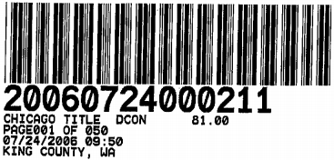

After Recording Mail to:  
Bryce H. Dille  
CAMPBELL, DILLE, BARNETT, SMITH & WILEY, P.L.L.C.  
317 S. Meridian  
P.O. Box 488  
Puyallup, WA 98371  

# CONDOMINIUM DECLARATION OF THIRTY THIRD PLACE CONDOMINIUMS

Grantor: Thirty Third Place, Inc., a Washington corporation  
Grantee: The Public  
Reference Numbers of Documents Assigned or Released:  
Legal Description (abbreviated): SW 1/4 of the NE 1/4 of Section 20, Township 25 North, Range 5 East of the W.M., Bellevue, King County, Washington  
Complete Legal Description is located on Exhibit "A" of document  
Assessor's Tax Parcel Number: 202505-9243  
Survey Map and Plans Recorded Under King County Auditor's Number: 20060724000210

Thirty Third Place, Inc., a Washington corporation, referred to in this Declaration as the "Declarant" is the owner of the property here in after described and submits the land described in Section 2 below and on Exhibit "A," together with all Buildings, and structures, and all casements, rights, and belonging thereto, and all items of personality intended for use in connection therewith to the provisions of the Condominium Act Chapter 64.34 RCW (the "Act").

## 1. DEFINITIONS

- "Act" or "Condominium Act" mum the Washington Condominium Act, Laws of 1989, Chapter 34; re-enacting and amending RCW 58.17.040; adding a new chapter to Title 64 RCW, as amended.
- "Articles" means the Articles of Incorporation for the Thirty Third Place Condominium Association.
- "Allocated interests" means the undivided interests in the Common Elements, the Common expense liabilities, and the votes in the Association allocated to each Unit.
- "Assessment" means all sums chargeable by the Association against a Unit including, without limitation: (a) regular and special Assessments for Common expenses, charges, and fines imposed by the Association; (b) interest and late charges on any delinquent account; and, (c) costs of collection, including reasonable attorney's fees, including those for appeals, incurred by the Association in connection with the collection of a delinquent Owner's account.
- "Assigned Parking Spaces" means the 81 covered parking spaces, 46 of which will be assigned to a unit.
- "Association" means the Thirty Third Place Condominium Association, the nonprofit corporation formed to manage the Condominium.
- "Association Management Documents" consist of this Declaration, the Articles of Incorporation, the Bylaws, and the Rules and Regulations, if any,
- "Board" or "Board of Directors" means the Board of Directors for Thirty Third Place Condominium Association.
- "Building" means the residential Buildings described in Section 3.
- "Bylaws" means the Bylaws of the Thirty Third Place Condominium Association.
- "Commercial purposes" means use for business or commercial purposes.
- "Common Elements or Facilities" means all portions of the Condominium other than the Units.
- "Common expenses" means expenditures made by, or financial liabilities of, the Association together with any allocations to reserves.
- "Common expense liability" means the liability for Common expenses allocated to each Unit pursuant to this Declaration.
- "Community area" means the community area as shown on the Survey Map and Plans.
- "Condominium" means the Property, portions of which are designated for separate ownership and the remainder of which is designated for common ownership by the Owners.
- "Conveyance" means any transfer of the ownership of a Unit, including a transfer by deed or by real estate contract and, with respect to a Unit in a Leasehold Condominium, a transfer by lease or assignment thereof, but shall not include a transfer solely for security.
- "Declarant" means Thirty Third Place, Inc., and its successors and assigns, but only if the rights of the Declarant are specifically assigned to the successors in writing.
- "Declarant control" means the right of the Declarant or persons designated by the Declarant to appoint and remove officers and members of the Board of Directors, or to veto or approve a proposed action of the Board or Association, as specified in this Declaration and pursuant to the Act.
- "Declaration" means this Declaration and any amendments thereto and subsequently recorded.
- "Development rights" means rights if expressly reserved by Declarant in this Declaration to:
(a) add Real Property or improvements to the Condominium; (b) create Units, Common Elements, or Limited Common Elements within the Real Property included or added to the Condominium; (c) subdivide Units or convert Units into Common Elements; (d) withdraw Real Property from the Condominium; and, (e) reallocate Limited Common Elements with respect to Units that have not been conveyed by Declarant.
- "Eligible Mortgagee" means the holder of a Mortgage on a Unit or the Condominium that has filed with the secretary of the Association a written request that it be given copies of notices of any action by the Association that requires the consent of Mortgagees.
- "Foreclosure" means a forfeiture or judicial or nonjudicial foreclosure of a mortgage, deed of trust, or real estate contract or a deed in lieu thereof.
- "Identifying number" means a symbol or address that identifies only one Unit in the Condominium.
- "Institutional holder" means a Mortgagee which is a bank, or savings and loan association, or established mortgage company, or other entity chartered under federal or state laws, any corporation or insurance company, or any federal or state agency.
- "Limited Common Element" means a portion of the Common Elements allocated by this Declaration or by operation of the Act for the exclusive use of one or more, but fewer than all, of the Units.
- "Manager" or "Managing Agent" means the person or company designated by Declarant or the Board to manage the Condominium.
- "Mortgage" means a mortgage, deed of trust, or real estate contract.
- "Mortgagee" means the beneficial owner, or the designee of the beneficial owner, of an encumbrance on a Unit created by a mortgage or deed of trust, and, except as otherwise herein set forth, shall also mean the vendor, or the designee of a vendor, of a real estate contract for the sale of a Unit.
- "Owner" or "Unit Owner" means the Owner of record, whether one or more persons, including the Declarant, of a Unit, but does not include a person who has an interest in the Unit solely as security for an obligation. Owner or Unit Owner also means the vendee, not the vendor, of a Unit under a real estate contract.
- "Person" means a natural person, corporation, partnership, limited partnership, corporation, trust, governmental subdivision or agency, or other legal entity.
- "Property" means the land, the Buildings, and all improvements to the Buildings, and any other structures now or hereinafter placed on that land described on Exhibit "A," which is now or is hereafter made a part of this Condominium.
- "Purchaser" means any person, other than Declarant who, by means of a sale, transfer or lease, acquires a legal or equitable interest in a Unit other than: (a) a leasehold interest, including renewal options, of less than 20 years at the time of creation of the Unit; or, (b) as security for an obligation.
- "Real Property" means any fee, leasehold, or other estate or interest in, over, or under land described in Exhibit "A," including structures, fixtures, and other improvements thereon and easements, rights, and interests pertinent to which by custom, usage, or law, pass with a conveyance of land although not described in the contract of sale or instrument of conveyance. Real property includes parcels, with or without upper or lower boundaries, and spaces that may be filled with air or water.
- "Residential Purposes" means use for dwelling or recreational purposes, or both.
- "Sale," "transfer," or "lease" means a voluntary transfer or conveyance to a purchaser or lessee of any legal or equitable interest in a Unit, but does not include the transfer or release of a security interest.
- "Special Declarant rights" means rights expressly reserved in this Declaration for the benefit of the Declarant to: (a) complete improvements indicated on the Survey Map and Plans filed with this Declaration; (b) exercise any Development right; (c) maintain sales offices, management offices, signs advertising the Condominium, and models; (d) use easements through the Common Elements for the purposes of making improvements within the Condominium or within real property which may be added to the Condominium; (e) make the Condominium part of a larger condominium or development; (f) make the Condominium subject to a master association; (g) appoint or remove any officer of the Association or any master association or any member of the Board of Directors during any period of Declarant control; and, (h) veto or approve any proposed action of the Board of Directors or Association during any period of Declarant control.
- "Survey Map and Plans" means the Survey Map and Plans recorded simultaneously-with this Declaration and any amendments, corrections, and addenda thereto subsequently recorded.
- "Total Voting Power" means the total number of votes that may be exercised at the time the vote is taken.
- "Unit" means a physical portion of the Condominium designated for separate fee simple ownership, the boundaries of which are described in this Declaration.

## 2. DESCRIPTION OF LAND

The Condominium consists of a parcel of land, located in King County, Washington, shown on that certain Survey Map and Plan, recorded simultaneously with the recording of this Declaration, under King County Auditor's File No. ___ and named "Thirty Third Place Condominiums." The legal description of the land is set forth in Exhibit "A."

## 3. DESCRIPTION OF BUILDINGS

The Condominium consists of five (5) residential buildings, containing forty-six (46) Condominium Units. Four of the buildings have three (3) levels and one of the buildings has two (2) levels. Three buildings contain twelve (12) Condominium Units each, one building contains four (4) Condominium Units, and one building contains six (6) Condominium Units. Each Unit and the corresponding level of the Building in which said Unit is located is identified more fully in Exhibit "B." The location of the Condominium and the Common Elements is shown on the Survey Map and Plans.

## 4. DESCRIPTION OF UNITS

### 4.1 Basic Units.

Each existing Unit is more fully described in Exhibit "B," including the number of bedrooms, bathrooms, built-in fireplaces, square footage, etc., in the Units, should it change. The Declarant reserves the right to amend the change should it change.

### 4.2 Unit Location.

The location of each Unit is as shown on the Survey Map and Plans.

### 4.3 Access to Public Streets.

Each Unit has access to common driveways which have access to the public streets.

### 4.4 Unit Boundaries.

The walls, floors, or ceilings are the boundaries of a Unit, and all lath, furring, wallboard, plasterboard, plaster, paneling, tiles, wallpaper, paint, finished flooring, and any other materials constituting any part of the decorative and finished surfaces thereof, are a part of the Unit. All other portions of the walls, floors, or ceilings are a part of the Common Elements.

If any chute, flue, duct, wire, conduit, bearing wall, bearing column, or other fixture lies partially within and partially outside the designated boundaries of a Unit, any portion thereof serving only that Unit is a Limited Common Element allocated solely to that Unit and any portion thereof serving more than one Unit or any portion of the Common Elements is a part of the Common Elements.

Subject to the above, all spaces, interior partitions, and other fixtures and improvements within the boundaries of a Unit are a part of a Unit.

Furthermore, any shutters, awnings, window boxes, doorsteps, stoops, decks, and all exterior doors, windows or other fixtures designed to serve a single Unit, but which are located outside the Unit's boundaries are Limited Common Elements allocated exclusively to that Unit.

In no event shall a Unit Owner be deemed to own pipes, wires, conduits, the attic crawl space, or other utility lines or commonly used space running through that Owner's Unit which are utilized for, or serve more than one Unit. These shall be part of the Common Elements. (However, crawl spaces, if any, accessing a particular Unit shall be deemed a Limited Common Element of that respective Unit and may be used by the respective Unit Owner at their discretion in a safe manner.)

### 4.5 Monuments as Boundaries.

The physical boundaries of a Unit as originally constructed, or as reconstructed in substantial accordance with the original plans thereto shall be conclusively presumed to be its boundaries rather than the metes and bounds expressed or depicted in the Survey Map and Plans, regardless of settling or lateral movement of the Building and regardless of minor variances between boundaries shown on the Survey Map and Plans and those of the Building.

### 4.6 Procedures for Altering or Subdividing Units.

(a) Subdividing Units. No Unit may be subdivided or the boundaries of a Unit be modified either by agreement or legal proceedings, except as provided in this Section.

  (i) An Owner may propose subdividing a Unit or the Owners of two or more Units may propose amending the legal boundaries between their adjoining Units by submitting a proposal in writing to the Board. As part of the application, the applicant shall prepare an amendment to the Declaration that: identifies the Units involved; assigns numbers to any new Unit; states the changes and reallocations of allocable interest, if any; is executed by those Unit Owners; and, contains words of conveyance between the applicants, if applicable. The applicants are also to have an amendment to the Survey Map and Plans prepared that complies with the Act and which shows the altered boundaries of the Unit(s) and their dimensions and Identifying Numbers. The amendment must be in form reasonably acceptable to the Board.

  (ii) The Board of Directors will have sixty (60) days after receiving the complete application and the proposed amendment to determine whether the subdivision or adjustments to the boundaries are reasonable and whether the proposed changes will materially and adversely affect the functionality of a Common Element. Failure to approve the application within said sixty (60) days will be deemed approval of the application. An application approved by the Board, must then be approved by an affirmative vote of sixty-seven percent (67%) of the Owners and fifty-one percent (51 %) of the Eligible Mortgagees, and all of the Eligible Mortgagees and Owners of the Units to be subdivided or the boundaries of which are to be adjusted.

  (iii) If approved as set forth above, and having received any governmental approvals that are necessary, the President of the Board will sign the documents implementing the amendment, and the applicant will cause the amendment and the amended Survey Map and Plan to be executed by the applicable parties and recorded.

  (iv) Any costs incurred by the Association relating to preparation, review or recording of the amendment shall be the responsibility of the applicants, and the Board may require adequate assurances of payment before approving the application.

(b) Combination of Adjoining Units. After acquiring an adjoining Unit or an interest in part of an adjoining Unit, an Owner may, with the approval of the Board and the Owner and the Eligible Mortgagees of both Units, remove or alter any intervening partition or create apertures therein, even if the partition in whole or in part is a Common Element, if those acts, in the Board's determination, do not adversely affect the structural integrity or acoustical properties of the Building or the plumbing, mechanical, or electrical systems serving another Unit or the Common Elements, or lessen the support of any portion of the Condominium or otherwise adversely affect other Units. Removal of partitions or creation of apertures under this subsection is not a relocation of boundaries and does not change the legal boundaries of the Unit. The Owner's proposal to act under this section is to be submitted to the Board and will include the plans and specifications for the proposed removal or alteration.

(c) Minor Alterations and Hard Surface Flooring. No Unit may be altered in any way except in accordance with this Section. An Owner may make any improvements or alterations to the Owner's Unit that do not adversely affect the structural integrity or acoustical Properties of the

Building, or adversely affect the plumbing, mechanical or electrical systems serving another Unit or the Common Elements, or lessen the support of any portion of the Condominium or otherwise adversely affect other Units. An Owner may not change the flooring in any portion of the Unit that is directly above another Unit from carpeting to hard surface flooring without the prior written approval of the Board. In connection with change from carpet to hard surface flooring, the Board may condition its approval upon installation of acoustical subflooring material and/or coverage of certain areas with carpet. An Owner may not change the appearance of the Common Elements or the exterior appearance of a Unit without the prior approval of the Board.

(d) Substantial Alterations. Except as provided herein, a proposal that would involve a substantial alteration of a Unit is subject to approval of the Board. The Board may retain, at the Owner's expense, an architect or engineer to review the plans and require evidence that all permits necessary for the work have been obtained or will be obtained. The Board shall approve an Owner's request under this section within sixty (60) days of receipt of the proposal, along with plans and specifications and an opinion of a qualified architect or engineer that the alteration will not adversely affect the structural integrity or acoustical properties of -che Building, or adversely affect the plumbing, mechanical or electrical systems serving another Unit or the Common Elements, or lessen the support of any portion of the Condominium or otherwise adversely affect other Units. The failure of the Board to act upon such a request within such period will be deemed approval thereof.

(e) Procedure After Approval. Upon approval of the proposed change under this Article, the Owner may proceed according to the proposed plans and specifications, provided that the Board may require that, before any work begins, the work be subject to the Board's review, adequate provision be made for payment of the work free and clear of liens, there are adequate protections in place against excessive noise and disruptions to other Owners and for the safety of the other Owners and the Common Elements, and that reasonable deadlines for completion of the work are established.

(f) Application to Declarant. The provisions of this Article will not apply to Declarant if exercising a Development right reserved in this Declaration.

## 5. DESCRIPTION OF COMMON ELEMENTS

The Common Elements consist of all portions of the Condominium except the Units, and including the following:

(a) the exterior windows, roofs, foundations, columns, girders, studding, joists, beams, supports, walls (excluding non-bearing interior partitions of Units, if any), and all other structural parts of the Buildings to the boundaries of the Units;

(b) the installations of central services such as: power, light, gas, hot and cold water, heating refrigeration, air conditioning and incinerating, pipes, wires, conduits, and other fixtures and equipment for all utilities existing for common use, but excluding plumbing, electrical and similar fixtures that are located within a Unit for the exclusive use of that Unit;

(c) garbage pick-up areas, stairways, and hallways in the Building(s);

(d) the paved areas for vehicular, bicycle and pedestrian traffic, and unassigned parking spaces;

(e) the yards, gardens, landscaped areas and walkways which surround and provide access to the Building(s).

The Real Property described in Exhibit "A."

## 6. DESCRIPTION OF LIMITED COMMON ELEMENTS

### 6.1 Limited Common Elements.

Certain portions of the Common Elements are reserved for exclusive use of the allocated Unit Owner(s) and are designated in this Declaration as "Limited Common Elements." These Limited Common Elements are allocated to the Unit(s) to which they are assigned. In addition to any Limited Common Elements provided by law or other provisions of this Declaration, the Limited Common Elements consist of the following:

(a) Mailboxes. Each Unit has, as a Limited Common Element, an assigned mailbox or mailbox area located at the discretion of the U.S. Postal Service. Designation of the mailboxes shall be made at the time of the initial sale of a Unit. The mailbox assignments shall be permanent and may not be severed from the Units, but will be assigned and transferred with the Units and will follow any and all conveyances of a Unit as a Limited Common Element of such Unit.

(b) Parking Space. Each Unit shall have set aside, as a Limited Common Element, one parking space for that Unit. Each Unit to which a parking space is assigned will have exclusive use of that parking space. The number of parking space assigned to a Unit and the identifying number is shown on Exhibit "B" and the location of the parking space(s) is shown on the Survey Map and plans. The Declarant reserves the right to assign to Units additional parking space(s) as a Limited Common Element and that assignment will be completed by a designation on said parking space as to the Unit to which it is assigned and it will not be necessary to amend either the Survey Map and Plans or the Declaration in order to assign an additional parking space to a Unit as a Limited Common Element.

(c) Decks/Patios. If a Unit Owner has a deck or patio adjoining their Unit, the deck or patio is a Limited Common Element of that Unit.

(d) Fireplaces . If the Unit Owner has a built-in fireplace, then that fireplace is a Limited Common Element of that Unit.

### 6.2 Transfer of Limited Common Elements.

(a) Reallocation Between Unit. Except for a reallocation by the Declarant pursuant to a Development right reserved in this Declaration, a Limited Common Element may only be reallocated between Units with the approval of the Board and by an amendment to this Declaration executed by the Owners and approved in writing by the Mortgagees holding Mortgages against the Units to which the Limited Common Element was and will be allocated. The Board will not unreasonably withhold its approval but, as to parking spaces and mail boxes, it will require that at least one parking space and one mail box be assigned to each Unit. Any costs incurred by the Association relating to preparation, review and recording of the amendment and, if necessary, the Survey Map and Plans, shall be the responsibility of the applicant.

(b) Common Element to Limited Common Element. Except as provided above and pursuant to the Development rights reserved to the Declarant in this Declaration, Owners of Units to which at least fifty-one percent (51%) of the votes are allocated, including one hundred percent (100%) of the Owner of the Unit to which the Common Element will be assigned, must agree to reallocate a Common Element as a Limited Common Element. Any reallocation or incorporation shall be reflected in an amendment of this Declaration and, if necessary, the Survey Map and Plans. This section shall not apply to the Declarant if exercising a Development right reserved in this Declaration.

(c) Common Element or Limited Common Element Added to a Unit. Except as provided above, Owners of Units to which at least sixty-seven percent (67%) of the votes are allocated, including one hundred percent (100%) of the Owners of the Unit to which the Common Element will be assigned, must agree to incorporate a Common Element or Limited Common Element into an existing Unit. Any reallocation or incorporation shall be reflected in an amendment of this Declaration and, if necessary, the Survey Map and Plans. This section shall not apply to the Declarant if exercising a Development right reserved in this Declaration.

## 7. ALLOCATED INTEREST IN COMMON ELEMENTS, COMMON EXPENSES, AND VOTING RIGHTS

### 7.1 Percentages: Ownership and Common Expenses.

The formula for determining each Unit Owner's undivided ownership interest in the Common Elements and each Unit Owner's Common Expense Liability shall be determined by dividing into 100 the total number of Units so that each Unit shall have a 1146th interest in the Common Elements and share of the Common Expense Liability.

### 7.2 Voting Rights.

For purposes of membership voting on any Association matter, each Unit shall have one vote regardless of percentages of ownership or values. No votes allocated to a Unit owned by the Association may be cast, and in determining the percentage of votes required to act on any matter, the votes allocated to Units owned by the Association shall be disregarded.

### 7.3 Restrictions on Reallocation.

The allocated interest appertaining to each Unit cannot be changed except as set forth in this Declaration. The allocated interest and the title to the respective Units shall not be separated or separately conveyed and each undivided interest shall be deemed to be conveyed with its respective Unit even though the description in the instrument of conveyance or encumbrance may refer only to the title to the Unit. Except where permitted by the Act, the Common Elements are not subject to partition; and, any purported conveyance, encumbrance, judicial sale, or other voluntary or involuntary transfer of an allocated interest made without the Unit to which that interest is allocated is void.

## 8. OWNERS ASSOCIATION

### 8.1 Form of Association.

The Association shall be organized as a nonprofit corporation under the laws of the state of Washington, Ch. 64.34. RCW and Ch. 24.03 RCW, and shall be known as Thirty Third Place Condominium Association.

### 8.2 Membership.

An Owner of a Unit shall automatically be a member of the Association, and shall remain a member of the Association until such time as ownership ceases for any reason, at which time membership in the Association shall automatically cease. Membership shall be appurtenant to and may not be separated from ownership of each Unit.

### 8.3 Board of Directors.

A Board of Directors shall manage the affairs of the Association. The number of Directors that shall constitute the initial Board shall be three (3). Until succeeded by the Directors elected by the Unit Owners, Directors need not be Unit Owners. Each Director shall hold office until such time as that Director's successor has been elected. If a Unit Owner is owned by a corporation, partnership, limited liability company, or other entity, then the entity may appoint an agent on its behalf and that agent may serve as a Director.

### 8.4 Declarant Control; Transition Date

Subject to subsection 8.5 below, the Declarant shall have the right to appoint or remove some or all of the Directors until the Transition Date. The Transition Date is the earliest of the following, at which time the Declarant's right to appoint Directors shall terminate:

(a) a date four (4) months after seventy-five percent (75%) of the Units which may be created have been conveyed to Unit Owners, other than Declarant; or

(b) a date five (5) years after the first Unit is conveyed; or

(c) a date sixty (60) days after 75% of the Units have been conveyed to Unit Owners other than the Declarant; or

(d) a date two (2) years after the last conveyance of a Unit to a Unit Owner other than the Declarant; or

(e) a date two (2) years after any development right to add new Units was last exercised; or

(f) the date on which the Declarant records an amendment to the Declaration pursuant to which the Declarant voluntarily surrenders the right to further appoint and remove officers and members of the Board of Directors. If Declarant voluntarily surrenders the right to appoint and remove officers and members of the Board of Directors before the Transition Date pursuant to this subsection, Declarant may require, for the duration of the period of Declarant control, that specified actions of the Board of Directors or Association, as described in the recorded instrument executed by the Declarant, be approved by the Declarant before those actions become effective.

On the happening of the earliest of the foregoing events, the Directors selected by the Declarant shall resign, to be succeeded by Directors elected by the Unit Owners. At that time, the control of the Condominium shall pass from the Declarant to the Association of Unit Owners and shall be carried out in strict accordance with the provisions of Chapter 64.34 RCW governing control of  the Association and the transfer thereof.

Until the Transition Date, the Declarant may veto or approve a proposed action of the Board or the Association, provided such action is taken in writing within thirty (30) days after receipt of written notice of the proposed action. Failure of the Declarant to timely veto or approve a proposed action shall be deemed an approval by the Declarant.

### 8.5 Election of Directors By Unit Owners During Declarant Control.

Not later than sixty (60) days after conveyance of twenty-five percent (25%) of the Units which may be created to Unit Owners other than a Declarant, at least one member (and not less than 25%) of the Board of Directors must be elected by Unit Owners other than the Declarant. Further, no later than sixty (60) days after conveyance of fifty percent (50%) of the Units which may be created to Unit Owners other than the Declarant, not less than thirty-three and one-third percent (33 1/3%) of the members of the Board of Directors must be elected by Unit Owners other than the Declarant.

### 8.6 Election of Directors After Declarant Control Terminates.

Within thirty (30) days after the Transition Date, the Unit Owners shall elect a Board of Directors of at least three (3) members, a majority of whom must be Unit Owners. The Board of Directors shall then elect officers from the members of the Board of Directors, as set forth in the Bylaws. The members of the Board of Directors and officers shall take office upon election.

### 8.7 Removal of a Director.

The Unit Owners, by a two-thirds (2/3) vote of the Total Voting Power in the Association present and entitled to vote at a meeting of the Unit Owners at which a quorum is present, may remove any member of the Board of Directors with or without cause, other than a member appointed by the Declarant prior to the Transition Date. The Declarant may not remove any member of the Board of Directors elected by the Unit Owners, even if that Director was elected during the Declatant's period of control.

### 8.8 Standard of Care.

If a Director is appointed by the Declarant, the care required of that Director shall be the care of a fiduciary to the Unit Owners; if a Director is elected by the Unit Owners, then the duty of care required shall be ordinary and reasonable care. However, if the statutory standard of care is, at any time, different than the standard of care set forth in this Declaration this Declaration shall be deemed amended so that the standard of care shall be that standard set forth statutorily for condominiums in the State of Washington. This subsection shall not apply where the consequences of such act, omission, error, or negligence are covered by the insurance obtained by the Board.

### 8.9 Indemnification.

The Association shall indemnify its Directors and officers against all liability, damage, and expense arising from or in connection with service as Directors and officers of this Association to the maximum extent and under all circumstances permitted by law.

### 8.10 Association Management Documents; Release of Prior Covenants.

The Unit Owners covenant and agree that the administration of the Association shall be in accordance with the provisions of the Association Management Documents, which consist of this Declaration, the Articles of lncorporation, the Bylaws, and the Rules and Regulations, if any. Except as limited herein or in the A1iicles or Bylaws, the Association will have all of the powers and authority as may be exercised by such a corporation under the laws of the State of Washington, including those authorized by the Act and by the non-profit corporation act, Chapter 24.03, Revised Code of Washington. The Bylaws specify procedural rules governing the conduct of the Association, the Board; and the Members, including but not limited to voting procedures, notice requirements quorum requirements, and special and annual meeting requirements. The initial Bylaws and Rules and Regulations may be adopted by the Declarant. Amendments may be made by the Declarant or the Association, following the procedure set forth in the Bylaws and this Declaration.

### 8.11 Professional Management.

In addition to all other powers conferred on the Board by this Declaration, the Association Management Documents, and law, the Board of Directors of the Association shall have the authority to enter into a contract for professional management of the Condominium. If the Board enters into such a contract, the maximum term shall not exceed one (1) year, and the contract shall be terminable without cause or payment of a termination fee on thirty (30) days written notice.

### 8.12 Registered Agent for the Association.

The name and address of the person to receive service of process in the cases provided for in the Act is Patrick Welton, 11000 N.E. 33rd Place, Suite 215, Bellevue, WA 98004. The Association may from time to time change the person to receive service of process as provided by law. Such change shall be effective when written notice of such action, signed and acknowledged by the President of the Association, is filed with the Secretary of State.

### 8.13 Termination of Contracts and Leases.

If entered into before the Board elected by the Unit Owners takes office, any management contract, employment contract, or lease of parking areas, or any other contract or lease between the Association and the Declarant, may be terminated without penalty by the Association at any time after the Board elected by Unit Owners takes office upon not less than ninety (90) days written notice to the other party or within such lesser notice period provided for in the contract or lease. This section does not apply to any lease, the termination of which would terminate the Condominium or reduce its size, unless the real property subject to that lease was included in the Condominium for the purpose of avoiding the fight of the Association to terminate a lease under this section.

### 8.14 Powers of the Association.

Unless limited in the Articles or Bylaws, the Association is authorized to have the power to:

(a) Adopt and amend Bylaws, rules, and regulations;

(b) Adopt and amend budgets for revenues, expenditures, and reserves, and impose and collect assessments for common expenses from Unit Owners;

(c) Hire and discharge or contract with managing agents and other employees, agents, and independent contractors;

(d) Regulate the use, maintenance, repair, replacement, and modification of common elements;

(e) Acquire, hold, encumber, and convey in its own name, any right, title or interest to real property, but common elements may be conveyed or subjected to a security interest only pursuant to Section 6.2 and RCW 64.34.348;

(f) Grant easements, licenses through or over the common elements and petition for or consent to the vacation of streets and alleys;

(g) Impose and collect any payments, charges, or fees for the use, rental, or operation of common elements, other than limited common elements, and for services provided to Unit Owners;

(h) Impose and collect charges for late payment of assessments pursuant to RCW 64.34.364(13) and Section 11 and 12 herein;

(i) Impose and collect reasonable charges for the preparation and recording of amendments to the Declaration, resale certificates required by RCW 64.34.425, and statements of unpaid assessments;

(j) Provide for the indemnification of its officers and board of directors and maintain directors' and officer's liability insurance;

(k) Assign its rights to future income, including the right to receive common expense assessments, but only to the extent provided for herein;

(l) Exercise all power authorized herein, in the Bylaws, in this state by the same type of corporation as the Association, and any other powers necessary and proper for the governance and operation of the Association.

### 8.15 Legal Proceeding.

The term Legal Proceedings as used herein shall include litigation, administrative, mediation, arbitration or other proceedings in the name of the Association on behalf of itself or two or more unit owners on matters affecting the condominium.

The provisions of the Section shall not apply to Legal Proceedings, as a result of which the Association could not be held responsible for costs of suit (including fees for attorneys, experts, witnesses, investigations and other costs of suit) in an aggregate amount of not more than $5,000, and which involve: (a) collection of delinquent regular or special Assessments, the enforcement of any Assessment lien, and interest and penalties in connection therewith; (b) collection of monies owed to the Association, or recovery of damages caused to the Association or Condominium (or any part thereof), when the principal amount to be recovered involves less than $25,000; (c) enforcement of the provisions of the Declaration, Articles, Bylaws or rules and regulations of the Association; or (d) defense of a claim against the Association, when the principal amount to be recovered involves less than $25,000.

In order for the Association (or the Board acting on behalf of the Association) to institute, defend, or intervene in Legal Proceedings, and in order for the Association to become obligated in the aggregate sum in excess of $5,000 to professionals, consultants or other experts in connection with Legal Proceedings, the following conditions must first be satisfied: (A) The Board has received a detailed written summary ("Litigation Summary") concerning the substance of the proceedings, including: (i) agreements with lawyers, experts and consultants; (ii) issues involved; (iii) legal and factual basis of anticipated allegations on behalf of and against the Association; (iv) remedies to be sought on behalf of and against the Association; (v) estimated amount to be sought on behalf of (and that could be sought from) the Association; (vi) Association's estimated costs of suit (including fees for attorneys, experts, witnesses, investigations and other costs of suit) and any third-party costs of suit that the Association would pay if the Association does not prevail; (vii) reports and recommendations by any professionals or consultants retained by the Association (and by any opposing party, if available); (viii) any written demands or settlement offers made by an opposing party ( the Board shall request that an opposing party make such demand and settlement offer); and (ix) any negative consequences that the Association, Condominium or Owners could suffer during such proceedings, including required disclosures to prospective purchasers, impediments to Unit refinancing, or diminishment of Unit value. If the proceeding will involve a claim against Declarant (or Declarant's contractor, subcontractors, vendors, suppliers or other professionals) concerning construction defects or other condition of the Condominium, the Litigation Summary will also include; a description of the construction defects or other condition (which shall also have been transmitted to Declarant); and any written response from Declarant concerning such defects (including any offer to settle by performing remedial work, payment of cash or a combination of both). A copy of the Litigation Summary shall be transmitted to all Owners, together with a written notice of the Owner's right of access to the Books and Records of the Association, and a written notice of a special Owner's meeting to be convened as provided in this Declaration, at which meeting Declarm1t and its representatives shall be entitled to attend and participate in on a non-voting basis. The Owners holding 67% of the total Association voting power must grant approval for the Association (or the Board acting on behalf of the Association) to institute, defend, or intervene in Legal Proceedings; provided, that under no circumstances may Legal Proceedings be commenced against Declarant (or Declarant's contractor, subcontractors, vendors, suppliers or other professional) with respect to any alleged construction defect or other condition which Declarant has agreed in writing to remedy and is proceeding with reasonable due diligence to do so.

Attorneys Fees. In any legal proceeding the arbitrator, judge, or similar fact finder shall have the discretion to award attorneys fees to the prevailing party together with all costs of suit.

## 9. RESTRICTIONS ON USE OF PROPERTY

### 9.1 Residential Use; Rules.

The primary use of the Building and the Units described in this are intended for Residential Purposes only, and their use is so restricted. In addition, the Board of Directors of the Association may, from time to time, by a vote of a majority of its members, make, alter, or repeal Rules ·and Regulations covering details of the operation and use of the Property, reserving to the Unit Owners the right to change or repeal such Rules and Regulations on the approval of fifty-one percent (5 1 %) of the Total Voting Power of the Association. No such Rule or Regulation shall change the requirement that the Units and Property be used only for Residential Purposes. Furthermore, no Unit shall be used principally for agricultural or farming purposes under any circumstances.

### 9.2 Use by Declarant.

The Declarant may maintain a sales office, management office, and model(s) within a Unit or on Common Elements in the Condominium until such time as its right to select Directors terminates pursuant to subsection 8.4. During this time, Declarant may maintain signs on the Common Elements advertising the Condominium.

### 9.3 Leases.

The leasing or renting of a Unit by its Owner, with the exception of the Declarant, shall be governed by the provisions of this subsection.

(a)  No Transit Purposes. With the exception of an Institutional Holder in possession of a Unit following a default in a first Mortgage, a foreclosure proceeding, or any deed or other arrangement in lieu of foreclosure, Unit Owners are prohibited from leasing their Unit(s) for less than thirty (30) days.

(b) Entire Unit . No Unit Owner may lease or rent less than the entire Unit.

(c) Written Leases. All leases and rental agreements of Units shall be in writing and the tenant shall be subject to all of the provisions of the Association Management Documents. A copy of any lease shall be delivered to the Secretary of the Association within seventy-two (72) hours of a lease being signed. An Owner leasing a Unit must provide any tenant of that Owner's Unit a copy of the Declaration, Articles of lncorporation, Bylaws, and Rules and Regulations, if any, prior to the tenant signing the lease. Any failure by tenant to comply with the terms of the Association Management Documents shall be a default under the lease. Any such lease shall provide that in the event that the Unit is sold by the Unit Owner, the lease shall terminate on the sale, and that the lease shall terminate upon foreclosure of a Unit by a Mortgagee constituting a first lien on such Unit. If any tenant violates or permits his/her guests to violate any of the Association Management Documents after notice of such violation has been given on two or more occasions, the Board may, at the expense of the Unit Owner, give notice of termination to the tenant or occupant of the Unit and the Owner thereof and have the authority to evict the tenant or occupant if the Owner fails to do so after notice from the Board. The Board shall have no liability for a good faith eviction. The Board may have a lien against a Unit Owner's Unit for the costs associated with the eviction, including costs, expenses, and reasonable attorney's fees and such may be collected in the same manner as Assessments are collected and foreclosed in Section 11.

(d) Parking Space Leases. A Unit Owner may lease its assigned parking space, but only if the assignee is a Unit Owner within the Condominium, and if the Association has been given notice of such a leasing arrangement. Further, the lease may be terminated upon 15 days notice, and will be automatically terminated upon the transfer of title of the Unit to which the parking space being rented is assigned as a Limited Common Element.

(e) Commercial Use Prohibited. No Unit Owner shall be permitted to rent or lease that Owner's Unit for commercial purposes.

(f) Rent to Association. If a Unit is rented by its Owner, the Board may collect, and the tenant shall pay over to the Board, so much of the rent for such Unit as is required to pay any amounts due the Association hereunder, plus interest and costs if the same are in default over thirty (30) days. Such payment will discharge the tenant's duty of payment to the Owner for rent, to the extent such rent is paid to the Association, but will not discharge the liability of the Owner or Purchaser and the Unit under this Declaration for Assessments and charges, or operate as an approval of the lease. The Board shall not exercise this power where a receiver has been appointed with respect to the Unit or its Owner; nor in derogation of any rights that a Mortgagee of such Unit may have with respect to such rents. Other than as stated in this section, there is no restriction on the right of any Unit Owner to lease or rent his or her Unit.

### 9.4 Signs.

Other than signs posted by the Declarant in connection with the development and sale of the Condominium, all signs shall be subject to regulation by the Board of Directors.

### 9.5 Vehicle Parking Restrictions.

Common Element and Limited Common Element parking spaces are restricted to use for parking of operable passenger motor vehicles such as automobiles, light trucks and passenger vans; other items and equipment may be parked or kept there only subject to the provisions of the Rules and Regulations. The Board may require removal of any vehicle (and any other personal property) improperly stored in parking spaces or any inoperative or unsightly vehicle. If the same is not removed, the Board shall cause removal at the risk and expense of the Owner. Residents' vehicles are expected to be parked within the space assigned to their Unit. Any parking spaces which are not assigned to a Unit as a Limited Common Element, either in this Declaration or subsequently by the Declarant as set forth in paragraph 6.1(b) above, then said unassigned parking spaces shall be for the exclusive use of owners or owners' guests and invitees on a first come basis. The Association shall have the right to adopt parking rules and regulations concerning the use of said m1assigned parking spaces, including restrictions as to use by unit owners and/or their guests and invitees.

### 9.6 Garbage and Refuse.

All garbage and other waste shall be discarded only in appropriate sanitary containers in designated garbage pick-up areas within the Common Elements. Disposal of waste, yard takings such as rocks, lawn and shrubbery clippings, garbage, dirt or other materials onto any Common Element shall be subject to fines established by the Board of Directors, plus all costs associated with removal and proper disposal by the Association and payable to the Association.

### 9.7 Nuisances.

No noxious, offensive, or undesirable thing, use, or activity shall be permitted or maintained within any Unit, or on any portion of the Property, including, but not limited to, odor, noise, vibration, or any machine or other installation that interferes with the safety, comfort, or health of any Unit Owner. If the Board determines that a thing or use is undesirable or noxious, that determination shall be conclusive. Likewise, all Unit Owners shall be considerate of all other Unit Owners and shall limit noise from emanating outside of their respective Unit within the hearing range of another Unit.

### 9.8 Antennas and Dishes.

No dish or other type of exterior antenna or receiver larger than one meter in diameter shall be allowed on any Unit Limited Common Element, Common Elements, or any other part of the Condominium unless approved by the Board. The use, installation and maintenance of antennas and dishes one meter or less in diameter shall be allowed, provided that the Board determines that: (a) its location is confined to a Unit Owner's Limited Common Elements; (b) it is not placed on any deck railing; and, (c) it cannot easily be seen from another Owner's Unit, Limited Common Elements, or from the exterior of the Building. The Association reserves the right to require that the antenna or dish be painted, screened or relocated should the Board determine that it is unsightly or obtrusive to the overall aesthetics of the Condominium. This provision shall be limited as provided by applicable law.

### 9.9 Pets.

No animals, livestock, or poultry of any kind, other than household pets, shall be kept, bred or maintained on any part of the Property. Unless otherwise approved by the Board, no more than two (2) household puts shall be permitted in the Unit. Unless otherwise approved by the Board, the maximum combined weight limit of such household pets shall not exceed forty (40) pounds and, in any case, such pets must not be kept, bred or maintained for any commercial use or purpose. For the purposes of this provision, "household pets" shall be limited to dogs, cats, and birds. No reptiles or members of the rodent species (i.e., gerbils, hamsters, mice, rats) shall be kept on any part of the Property. If a Unit Owner keeps, breeds, or maintains a dog, the Unit Owner must control the dog in such a way so as to minimize excessive noise from barking, and keep it on a leash at all times under the Unit Owner's control when outside of a Unit, or the dog shall be considered a nuisance and not permitted to remain on the Property. All Owners shall promptly remove and dispose of all animal waste and the Board may impose fines for failure to do so.

### 9.10 Business and Commercial Use of  Property.

No trade, craft, business, or manufacturing enterprise, or business or commercial activity of any kind shall be conducted or carried out in any Unit, or within the Property itself, unless the following conditions are met: (1) the Unit associated with the business or commercial use must serve as the primary residence for that Unit's Owner; (2) the existence or operation of the business is not apparent or detectable by sight, sound, or smell from outside the Unit; (3) the business activity does not involve regular visitation of the Unit by clients, customers, suppliers, or other business invitees or door-to-door solicitation of Unit Owners; and, (4) no goods, equipment, vehicles, and/or materials or supplies used in connection with any trade, service, or business shall be kept, parked, or stored outside of a Unit, for more than six (6) hours without being removed.

### 9.11 Alterations of Units.

An Owner may, at that Owner's sole cost and expense, make any improvements or alterations to the Owner's Unit that the Owner deems necessary or appropriate for the proper maintenance of that Owner's Unit. Any other improvements or alterations may be made subject to the provisions of subsection 9 .12.

### 9.12 Alterations of Common and Limited Common Elements.

An Owner may not change the appearance of any Common Element without permission of the Association. Any such change would require approval of the Board or a delegated subcommittee of the Board. The appearance of a Limited Common Element may not be changed without permission of the Board or a delegated subcommittee of the Board. However, Owners may tastefully decorate their deck with planters and furniture without approval from the Association but this does not include hot tubs or other items of equipment. The Board, at its discretion, may require the removal or alteration of any decoration which it reasonably determines to be obtrusive, out of character with the general setting and scheme of the Condominium, inappropriate because its use may contribute to cross noise or otherwise offend other units owners, or present risks to the safety of the Building or its occupants.

The provisions of this subsection shall not apply to Units owned by the Declarant until those Units have been sold by the Declarant.

### 9.13 Timeshares.

Time-sharing is prohibited.

### 9.14 Noise Control.

All Unit Owners and their tenants, guests, and other invitees, licensees, or guests, shall be required to minimize the transmission of noise from their Unit to other Unit Owners' hearing range within the Condominium. At a minimum, Unit Owners shall be required to limit noise generated from general household activity, movement, conversations, altercations, children's activity, music, radios, computers, games, televisions, household appliances, and other means of sound transmission so that it cannot be heard outside of the Owner's Unit by other Unit Owners, or so that it is not offensive and does not create a nuisance to other Unit Owners in the Condominium. Unit Owners shall take any and all necessary and precautionary steps to avoid sound transmission from their Unit to any other Unit adjoining or nearby. Replacement of any appliances or devices must be at least as sound insulated as the prior appliance or device.

## 10. EASEMENTS

### 10.1 General.

Each Unit Owner shall have a nonexclusive easement in and through every other Unit and the Common Elements and Limited Common Elements for all support elements and utility, wiring, heat and service elements, and for reasonable access thereto, as required for the continued operation and maintenance of this Condominium. Each Unit and all Common Elements and Limited Common Elements are subject to a nonexclusive easement for the benefit of the other Units for all duct work for the several Units, and for heating, ventilation, air conditioning, security and electrical entry system, if any, for each Unit. In addition, each Unit Owner shall have a nonexclusive easement for and may use the Common Elements (except Limited Common Elements) in accordance with the purpose for which they were intended, without hindering or encroaching on the lawful right of the other Unit Owners. Without limitation of the foregoing each Unit Owner shall have a right of ingress to and egress from that Owner's Unit, over and across the driveways, parking lot (if any), landscaping and sidewalks which are part of the Common Element.

### 10.2 Appurtenant.

The easements described above shall be appurtenant to and shall pass with the title to each Unit subject to the following:

(a)  the right of the Association to assess and collect dues and Assessments as defined in this Declaration;

(b) the right of the Association and any agents, employees, or its contractors to have reasonable entry upon reasonable notice into any Unit to make emergency repairs and to do other work reasonably necessary for the proper maintenance or operation of the Condominium; and

(c) the right of the Association to grant permits, licenses, and easements over the Common Elements for utilities, roads and other purposes reasonably necessary or useful for the proper maintenance or operation of the Condominium.

### 10.3 Encroachments.

In the event any portion of the Common Element encroaches on any Unit or any Unit encroaches on the Common Element or another Unit as a result of the construction, reconstruction, repair, shifting, settlement, or movement of any portion of the improvements, a valid easement for the encroachment and for the maintenance of the same shall exist, so long as the encroachment exists.

### 10.4 Declarant Reservations.

The Declarant, for itself, its successors and assigns, hereby reserves an easement over and upon the Common Element and Limited Common Elements for the purpose of completing the development and construction of any additional construction or improvements. Declarant will use its good faith efforts to minimize the noise and interference with use of the Common or Limited Common Elements, and will provide notices to the Owners notifying them whenever, in Declarant's judgment, the noise or interference may be significant but reasonably unavoidable.

### 10.5 Association Easement.

The Declarant, for itself, its successors and assigns, and the Association, hereby reserves an easement over and upon the Units, Common Elements and Limited Common Elements for the purpose of performing maintenance, repairs, and the general duties and obligations of the Association as set forth in the Act, this Declaration, and the Association Management Documents.

### 10.6 Authority to Grant Easements.

The Declarant, so long as Declarant owns any Units, and the Board on behalf of the Association have the authority to grant utility, road and similar easements, licenses, and permits, under, through or over the Common Elements and Limited Common Elements, that the Declarant or the Board determines are reasonably necessary to the ongoing development and operation of the Condominium.

## 11. ASSESSMENTS

### 11.1 Assessments for Common Expenses.

The Board of Directors shall from time to time, and at least annually, determine the amounts necessary to meet the Common expenses of the Association. The Common expenses shall include:

(a) all Common expenses defined in the Act;

(b) the maintenance of all the Common Areas including landscaping and irrigation of the Common spaces;

(c) any utility charges which are billed directly to the Association and which are not separately metered for each unit shall be paid by the Association (the Unit Owner shall be responsible for all utilities which are directly billed and/or metered to each Unit);

(d) all such other amounts as the Board of Directors may deem necessary or advisable for the lawful exercise of its powers and duties.

(e) any shared expense not defined in the Act nor listed above which are approved by the Board of Directors as a Common expense.

However, the following are modifications to the above collection of Common expenses:

(a) any Common expense associated with the operation, maintenance, repair, or replacement of a Limited Common Element shall be paid by the Owner of, or assessed against, the Unit to which that Limited Common Element is assigned if the maintenance, repair or replacement of the Limited Common Element results from unusual or abnormal wear and tear caused by that Unit Owner;

(b) Assessments to pay a judgment against the Association may be made only against the Units in the Condominium at the time the judgment was entered in proportion to their allocated Common expense liabilities at the time the judgment was entered; and

(c) to the extent that any Common expenses can be reasonably traced to the misconduct of any Unit Owner, the Association may assess that expense against the Owner's Unit.

### 11.2 Adoption of Annual Budget.

Within sixty (60) days prior to the begim1ing of each calendar year, or such other fiscal year as the Board may adopt, the Board shall adopt a budget for the continued maintenance and operation of the Condominium. The budget shall be sufficient to meet anticipated annual Common expenses, as well as funding reasonable reserves for contingencies and repair and replacement of capital expenditures, taking into consideration any shortfall or surplus from the prior year. A summary of the budget shall be provided to each Unit Owner within thirty (30) days of the Board's adoption of the budget. The Board shall set a date for an annual meeting of the Unit Owners to consider ratification of the budget (including Assessments) not less than fourteen (14) days nor more than sixty (60) days after mailing the summary. Unless at such meeting the Owners of Units to which a majority of the votes in the Association are allocated reject the budget, the budget is ratified. In the event the proposed budget is rejected or the required notice is not given, the periodic budget last ratified by the Unit Owners shall be continued until such time as the Unit Owners ratify a subsequent budget proposed by the Board.

### 11.3 Declarant's Payment Prior to Association Assessment.

Until the Association makes a Common expense Assessment, the Declarant shall pay all Common expenses.

### 11.4 Unit Owner's Allocated Liability.

Except for the modifications to Assessments under Section 11.1 above, all Common expenses must be assessed against all Units in accordance with the "Common Expense Liability" allocations set forth for each Unit in Exhibit B. The Board shall have the power to round up or round down any Common Expense assessment based on the Unit Owner's allocation percentages set forth in Exhibit B to the nearest dollar when, in their discretion, it is appropriate.

### 11.5 Surplus in Assessments.

The Board shall return to the Unit Owners in accordance with the allocation method set forth in this Declaration any Assessments which exceeded the actual expenses paid or incurred for that year and any applicable reserves, or apply such excess against the following years Assessment.

### 11.6 Reserves.

There shall be established in the budget an adequate reserve find for capital improvements, and the replacement of those Common Elements that must be replaced on a periodic basis, which fund shall be segregated from regular Assessments and placed in an interest bearing bank account to be used exclusively for capital improvements or replacement of Common Elements.

### 11.7 Working Capital Fund.

A working capital fund shall be established for the initial months of the Condominium's operations, by collecting at the time of initial sale of a Unit (or upon termination of the Transition Date, whichever occurs first) an amount equal to two (2) months of the Common Elements charge for that Unit. Each Unit's contribution to working capital shall be collected and transferred to the Association at the time the sale of the Unit is closed or within thirty (30) days after the Transition Date, whichever is earlier. Within thirty (30) days after the Transition Date, the working capital fund shall also be transferred to the Association for deposit in a segregated fund. Declarant must pay, at that time, each unsold Unit's share to the working capital fund. However, Declarant shall be reimbursed when the sale of a Unit closes for which Declarant had previously paid into the working capital fund. Amounts paid into this fund should not be considered as advanced payments of regular Assessments.

### 11.8 Commencement of Assessments.

The Declarant, in the exercise of reasonable discretion, shall determine when the Association shall commence making Assessments; provided, that Assessments shall commence as to all Units no later than sixty (60) days after the first unit is conveyed to Owners other than Declarant, and the initial amount assessed may change. Notwithstanding any other provisions herein, until the authority of the Declarant to designate the members of the Board of Directors terminates (that is, until the Transition Date), the Board may elect not to collect either the full budgeted Assessment for each month or any Assessment for reserve funds (other than reserves for insurance premiums) and instead may collect and expend only the actual costs of operation of the Common Elements.

### 11.9 Payment of Assessments; Personal Obligation.

Assessments are payable monthly, in advance, or at such other time(s) as the Board shall determine. Each Assessment, in addition to constituting a lien as provided for in the Act and this Declaration, shall also be, together with interest, costs, and reasonable attorneys' fees as hereinafter provided, the personal obligation of the person who was the Owner of the Unit against which the Assessment is made at the time the Assessment fell due. In addition to constituting a lien on the Unit, each Assessment shall be the joint and several obligation of the Owner or Owners of the Unit to which the same are assessed as of the time the Assessment is due.

### 11.10 Late Charges and Default Interest.

The Association may from time to time establish reasonable late charges and a rate of interest to be charged on all subsequent delinquent Assessments or installments thereof. Upon recording this Declaration, and until changed by the Association, any Assessment not paid within thirty (30) days after the due date shall bear interest from the due date at the rate of twelve percent (12%).

### 11.11 Collection of Assessments.

The Board may initiate an action to enforce payment of any delinquent Assessment. The Association shall be entitled to recover any costs and reasonable attorneys' fees (including those for appeals and bankruptcy proceedings), incurred in com1ection with the collection of delinquent Assessments, whether or not such collection activities result in suit being commenced or prosecuted to judgment, all of which shall be secured by the lien provided for in the Act and herein. In addition, the Board may enforce collection of delinquent Assessments in any one or more of the following methods:

(a) After ten (10) days prior written notice to the Owner of intent to sever utilities for delinquent Assessments, the utilities to the Unit on which the Assessment remains delinquent may be severed and disconnected in whole or in part until the Assessments are paid, or otherwise provided for, to the satisfaction of the Board; or

(b) ten(10) days prior written notice to the Owner, the Association may suspend the Owner's right of use of any Common Elements for any period during which any Assessment against the Owner's Unit remains unpaid; or

(c)  An action may be commenced to foreclose the lien for Assessments.

Suit to recover a personal judgment for any delinquent Assessment shall be maintainable in any court of competent jurisdiction without foreclosing or waiving the lien securing such sums.

### 11.12 Liability of Mortgagee or Purchaser.

Where the Mortgagee of a mortgage of record or other Purchaser of a Unit obtains possession of the Unit as the result of foreclosure of the mortgage, or by deed or assignment in lieu of foreclosure, such possessor, and that possessor's successors and assigns, shall not be liable for the share of the Common expenses or Assessments by the Association chargeable to such Unit which became due prior to such possession. Such unpaid share of Common expenses or Assessments shall be deemed to be Common expenses collectible from all of the Unit Owners, including such possessor, and that possess successors and assigns.

### 11.13 Conveyance; Liability of Grantor and Grantee for Unpaid Common Expenses.

In a voluntary conveyance, the grantee of a Unit shall be jointly and severally liable with the grantor for all unpaid Assessments against the latter for his share of the Common expenses up to the time of the grantor's conveyance, without prejudice to the grantee's right to recover from the grantor the amounts paid by the grantee therefor. Any such grantee shall be entitled to a statement from the Board setting forth the amount of the unpaid Assessments against the grantor and such grantee shall not be liable for, nor shall the Unit conveyed be subject to a lien for, any unpaid Assessments against the grantor in excess of the amount set forth in the Board's statement, unless and to the extent known by the recipient to be false.

### 11.14 Assessment Statements.

The Association on written request shall furnish to a Unit Owner or a Mortgagee a statement signed by an officer or authorized agent of the Association setting forth the amount of unpaid Assessments against that Unit. The statement shall be furnished within fifteen(15) days after receipt of the request and is binding on the Association, the Board of Directors, and every Unit Owner, unless and to the extent known by the recipient to be false.

### 11.15 Capital Improvements.

Anything in this Declaration to the contrary notwithstanding, the Board shall not make capital improvements to the Property having a cost of more than Ten Thousand Dollars($ 10,000.00) in the aggregate, during any calendar year, other than for repairing or restoring the Property as may be provided for in this Declaration or the Bylaws, without the prior approval of Owners holding fifty-one percent (51) of the Total Voting Power in the Association.

### 11.16 Nonuse.

No Unit Owner may exempt that Owner from liability for contribution towards the Common expenses by waiver of the use or enjoyment of any of the Common Elements or by abandonment of the Unit.

## 12. LIENS FOR ASSESSMENTS

### 12.1 Right of Association.

The Association has a lien on a Unit for any unpaid Assessments levied against a Unit from the time the Assessment is due, together with interest, late charges, and attorneys fees as provided in this Declaration or otherwise allowed by law.

### 12.2 Priority/Exceptions.

A lien under this section shall be prior to all other liens and encumbrances on a Unit except:  
(1) liens and encumbrances recorded before the recording of the Declaration, (2) a Mortgage on the Unit recorded before the date on which the Assessment sought to be enforced became delinquent, and, (3) liens for real property taxes and other governmental Assessments or charges against the Unit. A lien under this section is not subject to the provisions of Chapter 6.13 RCW.

### 12.3 Priority/Mortgages.

Except as provided in subsections 12.5 and 12.6 of this section, the lien shall also be prior to the mortgages described in subsection 12.2(2) of this section to the extent of Assessments for Common expenses, excluding any amounts for capital improvements, based on the periodic budget adopted by the Association pursuant to the Act which would have become due during the six (6) months immediately preceding the date of a sheriffs sale in an action for judicial foreclosure by either the Association or a Mortgagee, the date of a trustee's sale in a nonjudicial foreclosure by a Mortgagee, or the date of recording of the declaration of forfeiture in a proceeding by the seller/vendor under a real estate contract.

### 12.4 Reduction of Priority Period.

The priority of the Association's lien against Units encumbered by a Mortgage or hold by a Mortgagee that has given the Association a written request for a notice of delinquent Assessments shall be reduced by up to three (3) months if and to the extent that the lien priority under subsection 12.3 of this section includes delinquencies which relate to a period after such holder becomes an Eligible Mortgagee or has given such request for notice and before the Association gives the holder a written notice of the delinquency. This subsection does not affect the priority of mechanics' or materialmen's liens, or the priority of liens for other Assessments made by the Association.

### 12.5 Priority/Nonjudicial Foreclosure.

If the Association forecloses its lien under this section nonjudicially pursuant to Chapter 61.24 RCW, as provided by subsection 12.9 of this section, the Association shall not be entitled to the lien priority provided for under subsection 12.3 of this section.

### 12.6 Recording as Notice and Perfection.

Recording this Declaration constitutes record notice and perfection of the lien for Assessments. While no further recording of any claim of lien for Assessments under this section shall be required to perfect the Association's lien, the Association may record a notice of claim of lien for Assessments under this section in the real property records of any county in which the Condominium is located. Such recording shall not constitute the written notice of delinquency to a Mortgagee referred to in subsection 12.2 of this section.

### 12.7 Six Year Time Limit.

A lien for unpaid Assessments and the personal liability for payment of Assessments is extinguished unless proceedings to enforce the lien or collect the debt are instituted within six (6) years after the amount of the Assessments sought to be recovered becomes due.

### 12.8 Foreclosure Options.

The lien arising m1der this section may be enforced judicially by the Association or its authorized representative in the manner set forth in Chapter 61.12 RCW. The lien arising under this section may also be enforced nonjudicially in the manner set forth in Chapter 61.24 RCW for non-judicial foreclosure of deeds of trust. The Declarant hereby grants to Chicago Title Insurance Company (the "Title Company"), as Trustee, all Units in the Condominium and all Property of which the Condominium is a part. This grant is for the sole purpose of securing the obligations of the Unit owners to the Association for the payment of Assessments. Said Title Company shall act as Trustee for the benefit of the Association, as beneficiary. On default by any Unit Owner in the payment of any Assessments, and on the written request of the beneficiary, Trustee shall sell the trust property in accordance with the Deed of Trust Act of the State of Washington, at a public auction to the highest bidder. Any person, including the Association or its authorized representative, shall have the power to purchase the Unit at the foreclosure sale and to acquire, hold, lease, mortgage, or convey the same, except that the Trustee may not bid at the Trustees sale. The proceeds of the sale shall be applied as follows: (1) to the expense of the sale, including reasonable attorney's fees and costs; (2) to the obligation owed by the defaulting Unit Owner; and, (3) the surplus, if any, shall be distributed to the beneficiary to be added to the general Assessments fund of the Association. On an express waiver in the complaint of any right to a deficiency judgment in a judicial foreclosure action, the period of redemption shall be eight (8) months. For purposes of foreclosure, it is hereby declared that the Units and the appurtenant Common Elements are not used principally for agricultural purposes; Nothing in this section shall prohibit the Association from taking a deed in lieu of foreclosure. This power of sale is not an exclusive remedy; the Association may pursue any other remedy available under the terms of this Declaration or at law.

### 12.9 Receivers.

From the time of commencement of an action by the Association to foreclose a lien for nonpayment of delinquent Assessments against a Unit that is not occupied by the Owner of the Unit; the Association shall be entitled to the appointment of a receiver to collect from the tenant the rent for the Unit as and when due. If the rental is not paid, the receiver may obtain possession of the Unit; refurbish it for rental up to a reasonable standard for rental units in this type of condominium; rent the Unit or permit its rental to others; and, apply the rents first to the cost of the receivership and attorneys' fees thereof, then to the cost of refurbishing the Unit, then to applicable charges, then to costs, fees, and charges of the foreclosure action, and then to the payment of the delinquent Assessments. Only a receiver may take possession and collect rents under this subsection, and a receiver shall not be appointed less than ninety (90) days after the delinquency. The exercise by the Association of the foregoing rights shall not affect the priority of preexisting liens on the Unit.

### 12.10 Remedies Cumulative.

The remedies provided are cumulative, and the Board may pursue them concurrently, as well as any other remedies that may be available under law although not expressed herein.

## 13. INSURANCE

### 13.1 General Requirement for Property Insurance.

Commencing not later than the time of the first written conveyance of a Unit to a person other than the Declarant, the Board of Directors shall be required to obtain and maintain, paying the premiums as a Common expense:

(a) a "master" or "blanket" type of property insurance policy on the Condominium, which may, but need not include equipment, improvements, and betterments in a Unit installed by the Declarant or the Unit Owners, insuring against all risks of direct physical loss commonly insured against. The insurance shall include earthquake insurance if a majority of the Board of Directors approves such coverage, and if such coverage is available at a reasonable cost. All property covered by the policy shall be insured in an amount equal to one hundred percent (100%) of current replacement cost at the time the policy is purchased and at each renewal date, exclusive of land, excavations, foundations, and other items normally excluded from property policies. The blanket policy shall contain a standard mortgagee clause in favor of each mortgagee of a Unit, which clause shall provide that the loss, if any, thereunder shall be payable to such mortgagee as its interest may appear, subject, however, to the loss payments provisions in favor of the Association.

(b) comprehensive general liability insurance, including medical payments insurance covering all the Common Elements. Such insurance shall be not less than One Million Dollars ($1,000,000) for each single accident or occurrence arising out of in connection with use, ownership, or maintenance of the Common Elements and shall cover bodily injury, deaths of persons, and property damage, including water damage. The liability insurance policy shall cover each member of the Board of Directors, and each Unit Owner, with cross-liability endorsement to cover liabilities of the Unit Owners as a group to a Unit Owner. The amount of coverage can be increased at the discretion of the Board.

(c) blanket fidelity insurance in an amount determined by the Board, for all officers, directors, trustees, management agents,' employees of the Association, and all other persons handling or responsible for funds of or administered by the Association.

(d) workman's compensation insurance, to the extent required by applicable law.

(e) insurance against loss of personal property of the Association by fire, theft and other losses with deductible provisions as the Board deems advisable.

(f) such other insurance (including directors and officers liability) as the Board deems advisable; provided, that notwithstanding any other provisions, the Association shall continuously maintain in effect such casualty, flood and liability insurance and a fidelity bond meeting the insurance and fidelity bond requirements for condominium projects established by Federal National Mortgage Association, Government National Mortgage Association, Federal Home Loan Mortgage Corporation, U.S. Department of Veterans Affairs, or other governmental or quasi-governmental agencies involved in the secondary mortgage market, so long as any such agency is a Mortgagee or Owner of a Unit with the Condominium, except to the extent such coverage is not available or has been waived in writing by such agency.

### 13.2 Required Provisions.

The insurance policies carried pursuant to this Article shall provide that:

(a) each Unit Owner is an insured person under the policy with respect to liability arising out of the Owner's interest in the Common Elements or membership in the Association;

(b) the insurer waives its right to subrogation under the policy against any Unit Owner, member of the Owner's household, or tenant of the Owner;

(c) no act or omission by any Unit Owner, unless acting within the scope of the Owner's authority on behalf of the Association, will void the policy or be a condition to recovery under the policy;and

(d) it at the time of a loss under the policy, there is other insurance in the name of a Unit Owner covering the same risk covered by the policy, the Association's policy provides primary insurance.

### 13.3 Adjustment of Loss.

Any loss covered by the property insurance under subsection 13.1 of this Section must be adjusted with the Association, but the insurance proceeds for that loss are payable to any insurance trustee designated for that purpose, or otherwise to the Association, and not to any holder of a Mortgage. The insurance trustee or the Association shall hold any insurance proceeds in trust for Unit Owners and lienholders, as their interests may appear. Subject to the provisions of Section 14, the proceeds shall be disbursed first for the purpose of promptly repairing or rebuilding the damaged or destroyed property, and Unit Owners and lienholders are not entitled to receive payment of any portion of the proceeds unless there is a surplus of proceeds after the property has been completely repaired or restored or the Condominium is terminated.

### 13.4 Insurance Is Unavailable.

If the insurance described in this insurance section is not reasonably available, the Association promptly shall cause notice of that fact to be hand-delivered or sent prepaid by first class United States mail to all Unit Owners, to each Eligible Mortgagee, and to each Mortgagee to whom a certificate or memorandum of insurance has been issued at their respective last known addresses.

### 13.5 Insurance by Unit Owners.

An insurance policy issued to the Association does not prevent a Unit Owner from obtaining insurance for the Owner's own benefit. All Unit Owners shall carry additional insurance for their own benefit insuring their Unit, including carpeting, wall coverings, fixtures, furniture, furnishings, and other personal property. All such policies shall contain waivers of subrogation and the liability of the carriers issuing insurance obtained by the Board of Directors shall not be affected or diminished by reason of any such additional insurance carried by any Unit Owner.

### 13.6 Certificate of Insurance.

An insurer that has issued an insurance policy under this Article shall issue certificates or memoranda of insurance to the Association and, upon written request, to any Unit Owner or holder of a Mortgage. The insurer issuing the policy may not modify the amount or the extent of the coverage of the policy or cancel or refuse to renew the policy unless the insurer has complied with all applicable provisions of Ch. 48.18 RCW pertaining to the cancellation or nonrenewal of contracts of insurance. The insurer shall not modify the amount or the extent of the coverage of the policy, or cancel or refuse to renew the policy without complying with this Section.

### 13.7 Notification on Sale of Unit.

Promptly upon the conveyance of a Unit, the new Unit Owner shall notify the Association of the date of the conveyance and the Unit Owner's name and address. The Association shall notify each insurance company that has issued an insurance policy to the Association for the benefit of the Owners under this Section of the name and address of the new Owner and request that the new Owner be made an insured under such policy.

## 14. DAMAGE OR DESTRUCTION

### 14.1 Association to Represent Owners.

In the event of damage or destruction to all or part of the Property, the Association shall act as representative of the Owners and Mortgagees in any proceedings, negotiations, or settlements. Each Owner appoints the Association as its attorney-in-fact for this purpose. The insurance proceeds shall be paid to the Association for the benefit of the Owners and Mortgagees, and shall be used and distributed as set forth below. If sufficient the proceeds shall be applied to repair, reconstruct, or rebuild the Property in accordance with the original plans. Such repair, reconstruction, or rebuilding shall be promptly arranged by the Board of Directors. Furthermore, should a decision be made to not repair, reconstruct, or rebuild the Property, or should there be additional insurance funds available, the Association shall determine the allocation of those insurance funds.

### 14.2 Initial Board Determination.

In the event of damage or destruction to all or any part of the Condominium, the Board shall promptly, and in all events within thirty (30) days after the date of damage or destruction, or, if the damage or destruction did not occur at a particular identifiable time, after the date of its discovery, make the following determinations with respect to employing such advice as the Board deems advisable:

(a) the nature and extent of the damage or destruction, together with an inventory of the improvements and property affected;

(b) a reasonably reliable estimate of the cost to repair the damage, which estimate shall, if reasonably practicable, be based upon a firm bid obtained from a responsible contractor;

(c) the anticipated insurance proceeds, if any, to be available from insurance covering the loss based on the amount paid or initially offered by the insurer;

(d) the amount, if any, that the estimated cost of repair exceeds the anticipated insurance proceeds and the amount of Assessment to each Unit if such excess was paid as a Common expense and specially assessed against all Units in proportion to their allocated interest in the Common Elements; and

(e) the Board's recommendation as to whether the damage or destruction should be repaired.

### 14.3 Notice of Damage or Destruction.

The Board shall promptly, and in all events within thirty (30) days after the date of damage or destruction, provide each Owner and Eligible Mortgagee with written notice summarizing the initial Board determination made under section 14.2.

### 14.4 Duty to Restore.

Any portion of the Condominium which has been damaged or destroyed for which insurance proceeds are available shall be repaired or rebuilt promptly by the Association unless:

(a) the Condominium is terminated;

(b) repair or replacement would be illegal under any state or local health or safety statute or ordinance; or

(c) eighty percent (80%) of the Unit Owners, including every Owner of a Unit or assigned Limited Common Element that will not be rebuilt, vote not to rebuild.

The cost of repair or replacement in excess of insurance proceeds and reserves is a Common expense.

### 14.5 Board Authority to Implement Restoration.

If the damage or destruction is to be repaired or rebuilt, the Board shall have the authority to take all action reasonably necessary and appropriate to effectuate the repair or restoration.

### 14.6 Decision to Not Restore.

If all of the damaged or destroyed portions of the Condominium are not repaired or replaced:

(a) the insurance proceeds attributable to the damaged Common Elements shall be used to restore the damaged area to a condition compatible with the remainder of the Condominium;

(b) the insurance proceeds attributable to Units and Limited Common Elements which are not rebuilt shall be distributed to the Owners of those Units and the Owners of the Units to which those Limited Common Elements were allocated, or to lienholders, as their interests may appear; and

(c) the remainder of the proceeds shall be distributed to all the Unit Owners or lienholders, as their interests may appear, in proportion to the Common Element interests of all the Units.

### 14.7 Emergency Work.

The Board shall need no approval from the Association or a Unit Owner for emergency work. "Emergency work" shall mean that work, which the Board determines, is reasonably necessary to avoid further damage, destruction, or substantial diminution in value to improvements and to reasonably protect the Owners from liability resulting from the condition of the Property.

### 14.8 Reallocation.

If the Unit Owners vote not to rebuild any Unit, that Units allocated interests are automatically reallocated upon the vote as if the Unit had been condemned under Section 15, and the Association promptly shall prepare, execute, and record an amendment to this Declaration reflecting the reallocations.

## 15. CONDEMNATION

### 15.1 Association to Represent Owners.

If the Property is partially or completely condemned, the Association shall act as the representative of the Owners and Mortgagees in any proceedings, negotiations, or settlements. Each Owner appoints the Association as its attorney-in-fact for this purpose. Any proceeds shall be paid to the Association for the benefit of the Owners and the Mortgagees and shall be used and distributed as set forth below.

### 15.2 Partial Condemnation; Unit Usable.

In the event of partial condemnation which does not result in any Unit becoming unusable for any purpose permitted by this Declaration, the proceeds shall be used:

(a) to restore the remaining Common Element;

(b) for payment to Unit Owners and their Mortgagees specially damaged by the condemnation, which damage was an element of the condemnation award; and

(c) the balance shall be distributed pro rata among the Unit Owners and their Mortgagees in proportion to their percentage interest in the Common Element.

### 15.3 Partial Condemnation; Unit Unusable.

In the event of partial condemnation which does result in some, but not all, of the Units becoming unusable, the Association Management Documents, including the Survey Map and Plans, shall be amended to reflect any required elimination of Units and reallocation of percentage interest, and the condemnation proceeds shall be used:

(a) for payment to Unit Owners and their Mortgagees eliminated in the revised documents, to the extent the value of the entire Unit was an element of the condemnation award;

(b) toward restoration of the remaining Common Element;

(c) for payment to Unit Owners and their Mortgagees specially damaged by the condemnation, but which remain in the Condominium, which damages were an element of the condemnation award; and

(d) the balance shall be distributed pro rata to the remaining Unit Owners and their Mortgagees in proportion to their percentage interest in the Common Element.

### 15.4 Total Condemnation.

In the event that the entire Property is taken or condemned, or sold, or otherwise disposed of in lieu of, or in avoidance thereof, the condominium ownership pursuant thereto shall terminate. The condemnation award shall be apportioned among the Owners in shares proportionate to the respective undivided interest in the Common Element. If a standard different from the value of the Property as a whole is employed to measure the condemnation award in the negotiation, judicial decree, or otherwise, then in determining such shares, the same standard shall be employed to the extent it is relevant and applicable. On the basis of the foregoing principal, the Board of Directors shall, as soon as practicable, determine the share of the condemnation award to which each Owner is entitled.

## 16. LIMITATION OF BOARD AND ASSOCIATION LIABILITY

### 16.1 Liability for Utility Failure.

Except to the extent covered by insurance obtained by the Board pursuant to Section 13, neither the Association nor the Board shall be liable for: any failure of any utility or other service to be obtained and paid for by the Board; or for injury or damage to person or property caused by the elements, or resulting from electricity, noise, smoke, water, rain (or other liquid), dust or sand which may leak or flow from outside or from any parts of Buildings, or from any of its pipes, drains, conduits, appliances, or equipment, or from any other places; or for inconvenience or discomfort resulting from any action taken to comply with any law, ordinance or orders of a governmental authority. No diminution or abatement of Assessments shall be claimed or allowed for any such utility or service failure, or for such injury or damage, or for such inconvenience or discomfort.

### 16.2 No Personal Liability.

So long as a Board member Association committee member, Or Association official has acted in good faith, without willful or intentional misconduct upon the basis of such information as may be possessed by such person, no such person shall be personally liable to any Owner, or other party, including the Association, for any damage, loss or prejudice suffered or claimed on account of any act, omission, error or negligence (except gross negligence), including any discretionary decision, or failure to make a discretionary decision, by such person in such person's official capacity; provided that this section shall not apply where the consequences of such act, omission, error or negligence are covered by insurance obtained by the Board pursuant to Article 13.

## 17. MORTGAGEE'S PROTECTION

### 17.1 Amendments to Declaration or Bylaws and Extraordinary Actions.

The prior written approval of Owners who represent at least sixty-seven percent (67%)) of the total allocated votes in the Association and holders of at least fifty-one percent (5 1%) of the first Mortgages (based on one (1) vote for each first Mortgage owned) of the individual Units shall be required for (i) any "Extraordinary Actions" as described below, and (ii) any amendments of a material nature to this Declaration or the Bylaws of the Association.

### 17.2 Material Changes.

Any amendment to the Declaration or Bylaws which changes any of the following or involves any of the following actions, shall constitute a material change:

(a) voting rights;

(b) Assessment lien rights or the priority of such liens;

(c) reduction in the reserves required for maintenance, repair, or replacement of the Common Elements;

(d) responsibility for maintenance and repairs;

(e) allocation of interests in the Common or Limited Common Elements, or rights to their use, except as otherwise provided in this Declaration;

(f) the boundaries of any Unit;

(g) converts a Unit into Common Element, or of Common Element into Unit;

(h) expands or contracts the Condominium or results in the addition, annexation, or withdrawal of property to or from the Condominium, except as provided in this Declaration;

(i) hazard or fidelity insurance requirements;

(j) imposes new restrictions on leasing of Units;

(k) imposes of any restriction on the right of a Unit Owner to sell or trade his or her Unit;

(l) any provisions that expressly benefit mortgagees, insurers, or guarantors (i.e. mortgagee priority);

(m) increase Special Declarant's Rights; or

(n) increase or decrease use to which any Unit is restricted.

Furthermore, no amendment of this Declaration shall be effective to modify, change, limit, or alter the rights expressly conferred upon Mortgagees in this instrument with respect to any unsatisfied Mortgage duly recorded unless the amendment shall be consented to in writing by the holder of such Mortgage. Any provision of this Declaration conferring rights upon Mortgagees which is inconsistent with any other provision of this Declaration or the Bylaws shall control over such other inconsistent provisions.

### 17.3 Extraordinary Actions.

Any of the following, which shall constitute "Extraordinary Actions":

(a) increases in Assessments that raise the previously assessed amount by more than twenty-five percent (25%);

(b) a decision by the Association to establish self-management when professional management had been required previously by an Eligible Mortgagee;

(c) restoration or repair of the Condominium (after a hazard damage or partial condemnation) in a manner other than specified in this Declaration or the Bylaws;

(d) any action to terminate the legal status of the Condominium after substantial destruction or condemnation occurs;

(e) merging or consolidating the Association with another association, except as provided

(f) abandoning, encumbering, mortgaging, conveying, selling, or otherwise transferring Common Elements;

(g) partitioning or relocating the boundaries of a Common Element, except as provided in this Declaration;

(h) using insurance proceeds for purposes other than constructing or repair of the insured improvements, except as otherwise provided in this Declaration; or

(i) marking capital expenditures during any period of twelve (12) consecutive months costing more than twenty percent (20%) of the annual operating budget.

Until the authority of the Declarant to designate the members of the Board of Directors terminates (that is, until the Transition Date), all amendments to the Declaration and any Extraordinary Actions, as defined above, proposed must have the approval of the Veterans Administration (the "VA"), if the VA has guaranteed any loans secured by Units in this Condominium.

### 17.4 Request to Association.

On written request to the Association, an Eligible Mortgagee of a first mortgage on a Unit shall be entitled to timely written notice of:

(a) any significant damage or destruction to the Common Elements, or to the Unit to which the mortgage appertains (for purposes of this subsection, the term "significant damage or destruction" shall mean damage having a cost to repair of One Thousand Dollars ($1,000) or more to the mortgaged Unit or Ten Thousand Dollars ($10,000) or more to the Common Element or Building);

(b) any condemnation or eminent domain proceeding affecting the Condominium or any portion thereof;

(c) any default under this Declaration or the Articles of Incorporation or Bylaws which gives rise to a cause of action against the Owner of a Unit subject to the Mortgage of such holder or insurer, where the default has not been cured in thirty (30) days;

(d) any proposed termination of the Condominium regime;

(e) any lapse, cancellation or material modification of any insurance policy or fidelity bond maintained by the Association;

(f) any proposed amendment of the Condominium instruments affecting a change in (1) the boundaries of any Unit; (2) the undivided interest in the Common Elements appertaining to any Unit or the liability for Common expenses appertaining thereto, (3) the number of votes in the Association appertaining to any Unit; or (4) the purposes to which any Unit or the Common Elements are restricted;

(g) any sixty (60) days delinquency in the payment of Assessments or charges owned by the Owner of any Unit in which the Mortgagee holds the Mortgage, and

(h) any proposed action that requires a consent of a specified percentage of eligible mortgage holders.

### 17.5 Holder or Insurer of First Mortgage.

An Eligible Mortgagee of a first mortgage on a Unit shall be entitled, upon reasonable notice, to:

(a) inspect the books and records of the Association during normal business hours;

(b) require the preparation of and, if preparation is required, receive an annual audited financial statement of the Association for the immediately preceding fiscal year, except that such statement need not be furnished earlier than ninety (90) days following the end of such fiscal year; and

(c) receive written notice of all meetings of the Association and be permitted to designate a representative to attend all such meetings.

## 18. MAINTENANCE AND REPAIR

### 18.1 Owner Responsibility.

Each Owner, at that Owner's own expense, shall perform promptly all cleaning, maintenance, repair, and replacement work:

(a) within that Owner's Unit which, if omitted, would affect the Common Element;

(b) on the interior of all windows and screens bounding that Owner's Unit and the Unit Owner shall also be responsible for replacing any glass windows that are broken;

(c) within the Limited Common Element appurtenant to that Owner's Unit, including the balcony/deck, if any; however, decks will be painted and repairs, as to ordinary wear and tear, by the Association.

Without limiting the generality of the foregoing, each Owner shall be responsible for the construction, alteration, maintenance, repair or replacement of any plumbing fixtures, water heaters, fans, heating or other equipment, electrical fixtures or appliances which are used solely in connection with his or her Unit. In the event an Owner fails or refuses to perform the cleaning, maintenance, repair, and replacement work required by that Owner under the provisions of this section, then the Association may perform such work and the cost thereof shall be the personal obligation of the Owner of the Unit and shall constitute a lien on the Unit and its interest in the Common Elements and may be foreclosed in the same maimer as the lien for Assessments for Common expenses.

### 18.2 Association Responsibility.

All other maintenance and repairs shall be performed by the Association. Without limiting the foregoing, the Association shall maintain and repair the outside structural walls and railings of any decks and balconies. The Association may contract for all services on behalf of the Unit Owners. The cost thereof is to be a Common expense of all the Unit Owners who will be principally liable for the obligations.

### 18.3 Right of Entry.

The Association shall have the irrevocable right, to be exercised by the Board of Directors and its agents, to have access to each Unit and Limited Common Element from time to time during reasonable hours and upon reasonable notice as may be necessary for the maintenance, repair, or replacement of any of the Common Elements therein or accessible therefrom, or for making emergency repairs therein necessary to prevent damage to the Common Elements or to another Unit or Units, or to do any cleaning, maintenance, repair, and replacement work which the Owner is required to do but has failed or refused to do.

### 18.4 Exterior Appearance.

In order to preserve a desirable exterior appearance to the Buildings, and to the Common and Limited Common Elements, the Board may require and provide for the painting and other decorative finish of the Buildings, and to prescribe the type and color of such decorative finishes. The Board may prohibit, require, or regulate any modification or decoration of the Buildings, parking area, and landscaped areas or other Common or Limited Common Elements undertaken or proposed by any Owner. This power of the Board extends to screens, doors, awnings, rails, landscaping and decoration or other visible portions of each Unit and each Building.

## 19. COMPLIANCE WITH DECLARATION

### 19.1 Enforcement.

Each Owner shall comply strictly with the provisions of this Declaration, the Bylaws, and the Rules and Regulations, if any, for the Thirty Third Place Condominium Association (and as the same may be lawfully amended from time to time), and with all decisions adopted pursuant to this Declaration, the Bylaws, and Rules and Regulations, if any. Failure to comply shall be grounds for an action to recover sums due for damages or injunctive relief, or both, maintained by the Board (acting through its officers on behalf of the Owners), or by an aggrieved Owner or the Association based on a failure to comply. Further, if any dispute should arise regarding the terms of this Declaration, the Articles of Incorporation, the Bylaws, or any Rules or Regulations of the Association, the prevailing party shall recover reasonable attorney's fees and costs, including those for appeals.

### 19.2 No Waiver of Strict Performance.

The failure of the Board in any one or more instances to insist on the strict performance of this Declaration, the Bylaws, or the Rules and Regulations, if any, or to exercise any right or option contained in such documents, or to serve any notice or to institute any action, shall not be construed as a waiver or a relinquishment for the future of such term, covenant, condition, restriction, rule, or regulation, but such shall remain in full force and effect. The receipt by the Board of any Assessment by a Owner, with knowledge of any such breach shall not be deemed a waiver of such breach. No waiver by the Board of any provision hereof shall be deemed to have been made unless expressed in writing and signed by the Board. This section also extends to the manager and to Declarant or Declarant's managing agent, exercising the powers of the Board during the initial period of operation of the Association and Condominium development.

## 20. AVAILABILITY OF DOCUMENTS; FINANCIAL STATEMENTS

During normal business hours or under other reasonable circumstances, the Association shall have available for inspection by Unit Owners, prospective purchasers, and holders, insurers, or guarantors of any first mortgage current copies of the Declaration, Articles of lncorporation, Bylaws, the most recent financial statements, and all Rules and Regulations governing the operation of the Condominium. Any Owner, holder, insurer, or guarantor shall, upon written request and without charge, be entitled to an audited financial statement, if required, for the preceding year. If there is no audited statement available, any Owner, holder, insurer, or guarantor may have an audited statement prepared at the Owner's, holder's, insurer's, or guarantor's expense. The statement shall be furnished within a reasonable time following the request. At least annually, the Association shall prepare, or cause to be prepared, a financial statement of the Association in accordance with generally accepted accounting principles. The financial statements of the Condominium if consisting of fifty (50) or more Units shall be audited at least annually by a certified public accountant. If the Condominium consists of fewer than fifty (50) Units, an annual audit is also required but may be waived in any given year by Unit Owners other than the Declarant to which sixty percent (60%) of the votes are allocated, excluding the votes allocated to Units owned by the Declarant.

## 21. ASSOCIATION AMENDMENTS

### 21.1 Approval

Except as provided in certain sections of this Declaration and the Act, the Declaration, including the Survey Map and Plans, may be amended only by agreement of sixty-seven percent (67%) of the Unit Owners. No action to challenge the validity of an amendment adopted by the Association under this Section may be brought more than one (1) year after the amendment is recorded. Any amendment to this Declaration shall require (a) at least 25 days advance notice to all Owners; (b) the notice must state the purpose of the meeting and a summary of amendments proposed; (c) the notice must contain a copy of the proxy that may be cast in lieu of attendance, if permitted in the Bylaws; and (d) a quorum of at least twenty percent (20%) of the total number of votes must be met.

### 21.2 Recording.

When an amendment has been approved by the Owners, then the President of the Association shall forthwith cause a written instrument to be prepared, acknowledged, and recorded in King County, Washington, setting forth the amendment and certifying when the amendment shall become effective. No amendment shall be effective until recorded.

### 21.3 Amendments to Special Declarant's Rights.

No amendment may restrict, eliminate, or otherwise modify any Special Declarant rights provided in this Declaration without the consent of the Declarant and any Mortgagee of record with a security interest in the Special Declarant right or in any Real Property subject thereto, excluding Mortgagees of Units owned by persons other than the Declarant.

## 22. DEVELOPMENT RIGHTS

### 22.1 Reservation of Rights.

The Declarant, for itself and any successor Declarant, has reserved the following Development rights:

(a) Add real property or improvements to the Condominium, as shown on the Survey Map and Plans, in accordance with RCW 64.34.236(2) and all applicable zoning, Building, and subdivision laws and ordinances;

(b) Without limiting the foregoing, Declarant is authorized to complete construction of the Units or to assign the right to complete those Units to a purchaser of a Unit and then to amend Exhibit "B" to reflect the number of bathrooms, bedrooms, built-in fireplaces, and other pertinent information reflecting the completed Unit;

(c) Subdivide Units or Convert Units into Common Elements, in accordance with RCW 64.34.236(3) and allocate as if by condemnation under RCW 64.34.060;

(d) Withdraw Real Property from the Condominium, in accordance with RCW 64.34.236(4) and all applicable zoning, Building, and subdivision laws and ordinances, subject to such right expiring if Unit is sold on that portion prior to Declarant exercising this right; and

(e) Reallocate Limited Common Elements with respect to Units that have not been conveyed by Declarant.

(f) The right, and obligation, to construct a driveway and Additional Uncovered Parking Spaces, as shown on the Survey Map and Plans, and to remove the existing landscaping in the location of the proposed driveway. Declarant will also install landscaping and lighting as appropriate. The driveway, Additional Uncovered Parking Spaces, lighting, landscaping and related improvements will be of a style and quality comparable to the currently existing at the Condominium. Once constructed, the driveway, lighting, landscaping and related improvements will become Common Elements, and the Additional Uncovered Parking Spaces will become Limited Common Elements, and Declarant reserves the right to sell and assign the Additional Uncovered Parking Spaces to owners or prospective owners of Units on such terms and conditions as Declarant may determine in its sole discretion.

### 22.2 Exercise of Development Rights.

To exercise any Development right reserved under this section, the Declarant shall prepare, execute and record an amendment to the Declaration under RCW 64.34.264 and comply with RCW 64.34.232, RCW 64.34.228, RCW 64.34.216, and RCW 64.34.220. The approval of Unit Owners or the Association is not required before a Declarant may exercise Development Rights. Nevertheless, each Owner agrees to cooperate with Declarant in exercising these rights and to provide such consents and approvals as Declarant may reasonably request in implementing such rights.

### 22.3 Property to Which Development Rights Apply.

The Development rights reserved in this Declaration apply to the Real Property described on Exhibit "A," and as shown on the Survey Map and Plans.

### 22.4 Power of Attorney.

For purposes of this section, each Unit Owner, by acceptance of a Deed, irrevocably constitutes and appoints the Declarant or its successors and assigns, its true and lawful attorney in name, place and stead, to execute, acknowledge or verify, and file or record any and all documents to effect the amendment exercising any Development night, giving and granting unto his attorney in fact full power and authority to do and perform each and every act and thing whatsoever requisite and necessary to be done in and about the Property for such purposes as wholly and to all intents and purposes as he might or could do if personally present with respect thereto, hereby ratifying and confirming all that his attorney in fact shall do or cause to be done, it being expressly understood that the foregoing power is coupled with an interest and shall survive the conveyance by a Unit Owner of his interest in his Unit. Nothing herein contained shall require any person to investigate the authority of the Declarant or its successors and assigns to execute any instrument under the authority of this power of attorney.

### 22.5 Quality of Units to be Created; Indemnification.

Any additional Units that are created by the exercise of Development rights shall be consistent with the Units hereby created in structure type and quality of construction. Declarant shall indemnify and hold Owners harmless from any claims, liens, or damage resulting from the creation of additional Units or the exercise of Development rights pursuant to this section.

### 22.6 Termination of Development Rights.

Unless voluntarily terminated by Declarant at an earlier date, the foregoing Development rights shall continue so long as Declarant is completing improvements which are within or may be added to this Condominium, or Declarant owns any Units, or any Special Declarant right remains in effect, unless otherwise stated as to a specific right; provided, any phasing rights shall terminate seven (7) years after the recording of the Declaration.

### 22.7 Transfer of Declarant's Rights.

If Declarant shall transfer Declarant's rights prior to termination of Declarant's rights, Declarant shall record a transfer document with the County Auditor in which any portion of the Condominium is located.

## 23. SPECIAL DECLARANT RIGHTS

### 23.1 Reservation of Rights.

Declarant, for itself and any successor Declarant, has reserved the following Special Declarant rights:

(a) Complete improvements and otherwise perform work authorized by the Declaration, the Public Offering Statement, the Purchase and Sale Agreement, and in accordance with the standard Limited Warranty and Survey Map and Plans, even though Declarant may be completing construction in the Building after the Unit Owner takes possession of the Unit.

(b) Exercise any Development right.

(c) Maintain sales offices, management offices, signs advertising the Condominium, model units, or any other facility in the sole opinion of the Declarant that may be reasonably required, convenient or incidental to the construction, sale or rental of Units and appurtenant interests. Any such facilities not designated as a Unit by this Declaration is a Common Element and, if Declarant ceases to be a Unit Owner, the Declarant ceases to have any rights with regard thereto unless it is removed promptly from the Condominium, which Declarant shall have the right to do. The number, size, location and relocation of such facilities shall be determined from time to time by Declarant in the exercise of its sole discretion; provided that the maintenance and use of such facilities shall not unreasonably interfere with a Unit Owner's use and enjoyment of the Unit and appurtenant Limited Common Elements, and those portions of the Limited Common Elements reasonably necessary to the use and enjoyment of such Unit and Limited Common Elements.

(d) Use easements through Common Elements for the purpose of discharging its obligations, making improvements within the Condominium or within real property that may be added to the Condominium, or to exercise any Development Right or Special Declarant Right.

(e) Appoint or remove any officer of the Association or any member of the Board of Directors during the period of Declarant control, as set forth in Section 8 above.

(f) Veto or approve a proposed action of the Board of Directors of the Association during to period of Declarant control, as set forth in Section 8 above.

### 23.2 Termination of Special Declarant Rights.

Unless voluntarily terminated by Declarant at an earlier date, the foregoing Special Declarant rights shall continue so long as Declarant is completing improvements which are within or may be added to this Condominium, or Declarant owns any Units, or any Development right remains in effect, unless otherwise stated as to a specific right; provided, any phasing rights shall terminate seven (7) years after the recording of the Declaration.

## 24. MISCELLANEOUS

### 24.1 Termination of Condominium Title.

This Condominium may be terminated only by agreement of the Unit Owners of Units to which at least eighty percent (80%) of the votes in the Association are allocated. The procedures for termination must comply with the Act and as it is amended. Each Unit Owner by acceptance of that Owners deed, irrevocably constitutes and appoints the President of the Board of Directors its true and lawful attorney in that Owner's name, place and stead, with the power to execute, acknowledge or verify, and file or record any and all documents to effect such termination. Each Owner gives and grants unto such attorney in fact, full power and authority to do and perform each and every act whatsoever requisite and necessary to be done in and about the Property for such purposes and wholly and to all intents and purposes that she/he might or could do if personally present with respect thereto. Each Owner also hereby ratifies and confirms that all that the attorney shall do or cause to be done, it being expressly understood that the foregoing powers coupled with an interest and shall survive that conveyance by an Owner of that Owner's interest in the Unit. Nothing herein contained shall require any person to investigate the authority of the Board of Directors, or its successors or assigns, to execute any instrument under the authority of this power of attorney.

### 24.2 Covenant Running With Land.

This Declaration shall be deemed to be a set of covenants running with the land which shall be binding on the Declarant, its successors and assigns, and all subsequent Owners and lessees of the Property, together with their grantees, successors, heirs, executors, administrators, devisees, or assigns. It shall be interpreted pursuant to the Art and shall operate independently of the Act~ should the Act be inapplicable in any manner. Further, the provisions of this Declaration shall be liberally construed to effectuate its purpose of creating a uniform plan for the development and operation of the Condominium under the provisions of Washington law.

### 24.3 Cumulative Remedies.

All remedies available to the Unit Owners, Board of Directors, and Association under the terms of this Declaration are cum1ilative, and nothing in this Declaration shall be construed to limit any remedy available to any Unit Owner, the Board of Directors, or the Association provided for under the laws of the State of Washington.

### 24.4 Severability.

If any provision of this Declaration or its application to any person a circumstance is held invalid, the remainder of the Declaration, or the application of the provisions to other persons or circumstances is not affected.

### 24.5 Free Transferability.

Neither this Declaration, nor the Articles of lncorporation, Bylaws, or Rules and Regulations of the Association shall contain a right of first refusal or similar restriction on the sale, transfer or conveyance of any Unit or any restriction on the right of an Owner to mortgage that Owner's Unit. It is hereby affirmatively provided that any Unit Owner may transfer his or her Unit free of any such restriction.

### 24.6 Construction.

In the event that a conflict arises between any of the provisions of the Declaration and the Condominium Act, the Act shall prevail. In the event that a conflict arises between any of the Association Management Documents, the Declaration shall prevail, except to the extent that it may be inconsistent with the Act. In the event that a conflict arises between the Articles and Bylaws, the Articles shall prevail. Any insignificant errors or failures in any of the Association Management Documents shall not impair the creation of this Condominium or title to a Unit and Limited Common Element and a Unit Owner's interest in the Common Elements.

**IN WITNESS WHEREOF,** the undersigned have caused this Declaration to be executed this 15 day of May, 2006.

    

        

            
<strong>DECLARANT: </strong>Thirty Third Place, Inc.

            
By: 

            
Patrick Welton, Vice President

        

    

**STATE OF WASHINGTON )**

**COUNTY OF PIERCE )**

On this day personally appeared before me Patrick Welton to me known to be the individual described in and who executed the within and foregoing instrument, and acknowledged that he signed the same as his free and voluntary act and deed, for the uses and purposes therein mentioned.

**GIVEN** under my hand and official seal this 15 day of May, 2006.

    

        

            
        

    

    

        

            

            
Printed Name: B Dilly

            
<strong>NOTARY PUBLIC</strong> in and for the State of Washington, residing at Taloma

            
My commission expires:

        

    

# EXHIBIT "A" LEGAL DESCRIPTION

LOT 3, OF BELLEVUE SHORT PLAT NO. 80.06R RECORDED UNDER RECORDING NUMBER 8101059002, IN KING COUNTY, WASHINGTON; TOGETHER WITH AN EASEMENT OVER A PORTION OF LOT 2 OF SAID SHORT PLAT AS DELINEATED THEREOF; THE SAME AS CONVEYED BY DEED RECORDED UNDER RECORDING NUMBER 8412110772.

# EXHIBIT "B"

Description of Units:

| Unit Identifying Number | Floor | Number of Bathrooms | Number of Bedrooms | Approximate Square Footage of Unit | Parking Space Number assigned to Unit as Limited Common Element | Allocated Interest in Common Element/Common Expense |
| --- | --- | --- | --- | --- | --- | --- |
| A-1 | 1st | 1   | 1   | 629 | 39  | 1/46th |
| A-2 | 1st | 1   | 2   | 842 | 44  | 1/46th |
| A-3 | 2nd | 1   | 1   | 657 | 37  | 1/46th |
| A-4 | 2nd | 1   | 2   | 856 | 36  | 1/46th |
| A-5 | 3rd | 1   | 1   | 657 | 41  | 1/46th |
| A-6 | 3rd | 1   | 2   | 856 | 40  | 1/46th |
| A-7 | 1st | 1   | 2   | 845 | 38  | 1/46th |
| A-8 | 1st | 1   | 1   | 629 | 42  | 1/46th |
| A-9 | 2nd | 1   | 2   | 857 | 43  | 1/46th |
| A-10 | 2nd | 1   | 1   | 657 | 46  | 1/46th |
| A-11 | 3rd | 1   | 2   | 856 | 45  | 1/46th |
| A-12 | 3rd | 1   | I   | 657 | 35  | 1/46th |
| B-1 | 1st | 1   | 2   | 830 | 19  | 1/46th |
| B-2 | 1st | 1   | 2   | 830 | 27  | 1/46th |
| B-3 | 2nd | 1   | 2   | 855 | 21  | 1/46th |
| B-4 | 2nd | 1   | 2   | 855 | 22  | 1/46th |
| B-5 | 3rd | 1   | 2   | 855 | 23  | 1/46th |
| 8-6 | 3rd | 1   | 2   | 855 | 30  | 1/46th |
| B-7 | 1st | 1   | 2   | 830 | 24  | 1/46th |
| B-8 | 1st | 1   | 2   | 830 | 29  | 1/46th |
| B-9 | 2nd | 1   | 2   | 842 | 28  | 1/46th |
| B-10 | 2nd | 1   | 2   | 842 | 25  | 1/46th |
| B-11 | 3rd | 1   | 2   | 842 | 26  | 1/46th |
| B-12 | 3rd | 1   | 2   | 842 | 20  | 1/46th |
| C-1 | 1st | 1   | 2   | 830 | 18  | 1/46th |
| C-2 | 1st | 1   | 2   | 830 | 17  | 1/46th |
| C-3 | 2nd | 1   | 2   | 852 | 34  | 1/46th |
| C-4 | 2nd | 1   | 2   | 852 | 33  | 1/46th |
| C-5 | 3rd | 1   | 2   | 852 | 32  | 1/46th |
| C-6 | 3rd | 1   | 2   | 852 | 31  | 1/46th |
| D-1 | 1st | 1   | 1   | 636 | 12  | 1/46th |
| D-2 | 1st | 1   | 2   | 832 | 11  | 1/46th |
| D-3 | 2nd | 1   | 1   | 656 | 7   | 1/46th |
| D-4 | 2nd | 1   | 2   | 851 | 15  | 1/46th |
| D-5 | 3rd | 1   | 1   | 656 | 16  | 1/46th |
| D-6 | 3rd | 1   | 2   | 851 | 8   | 1/46th |
| D-7 | 1st | 1   | 2   | 847 | 2   | 1/46th |
| D-8 | 1st | 1   | 1   | 636 | 3   | 1/46th |
| D-9 | 2nd | 1   | 2   | 859 | 4   | 1/46th |
| D-10 | 2nd | 1   | 1   | 667 | 6   | 1/46th |
| D-11 | 3rd | 1   | 2   | 859 | 5   | 1/46th |
| D-12 | 3rd | 1   | 1   | 667 | 1   | 1/46th |
| E-1 | 1st | 1   | 1   | 640 | 14  | 1/46th |
| E-2 | 1st | 1   | 1   | 640 | 9   | 1/46th |
| E-3 | 2nd | 1   | 1   | 654 | 13  | 1/46th |
| E-4 | 2nd | 1   | 1   | 654 | 10  | 1/46th |