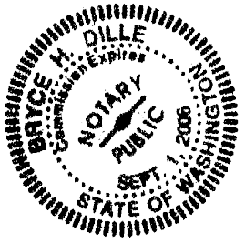

After Recording Mail to:  
Bryce H. Dille  
CAMPBELL, DILLE, BARNETT, SMITH & WILEY, P.L.L.C.  
317 S. Meridian  
P.O. Box 488  
Puyallup, WA 98371  

# FIRST AMENDMENT TO CONDOMINIUM DECLARATION OF THIRTY THIRD PLACE CONDOMINIUMS

Grantor: Thirty Third Place Condominium Association  
Grantee: The Public  
Reference Numbers of Documents Assigned or Released: 20060724000211  
Legal Description: Units 1 through 26 of the Thirty Third Place Condominiums recorded under King County Auditor's Recording No.20060724000211 with Survey Map and Plans recorded under King County Auditor's Recording No. 20060724000210.  
Assessor's Tax Parcel Number: 202505-9243.

Pursuant to the applicable provisions of RCW 64.34, and in compliance with the amendment provisions of the Condominium Declaration recorded on the 24th day of July, 2006, under King County Auditor's Recording No. 20060724000211 together with the Survey Map and Plans recorded under King County Auditor's Recording No. 20060724000210, the Declarant does hereby amend the same and states as follows:

There shall be added to **Section 9.3, Leases,** a new provision which shall be identified as 9.3 (g), **Restriction on Number of Units Rented,** which shall read as follows:

With the exception of a lender in possession of a unit following a default in a first mortgage or foreclosure proceeding, and with the exception of units owned by the Declarant, no more than ten (10) units can be leased at any one time by unit owners to non-unit owners. However, upon a showing of hardship or other extraordinary circumstances, the board, in its sole discretion, may waive this requirement for a unit owner requesting rental of the unit when there are no units available for rent under this section upon such terms and conditions as the board, in its sole discretion, shall deem appropriate.

All other remaining terms and provisions of this aforesaid Declaration shall remain in full force and effect, except as expressly modified and amended herein.

**IN WITNESS WHEREOF,** the undersigned have caused this First Amendment to Declaration to be executed this ____ day of ____, 2006.

    

        

            
<strong>DECLARANT: </strong>Thirty Third Condominium Association

            
By: 

            
Vice President

        

    

**STATE OF WASHINGTON )**

**)§**

**COUNTY OF KING )**

On this day personally appeared before me Patrick Welton Vice President of Thirty Third Condominium Association, the corporation that executed the foregoing instrument, and acknowledged that he signed the same as his free and voluntary act and deed, for the uses and purposes therein mentioned.

**GIVEN** under my hand and official seal this 19th day of October, 2006

    

        

            
        

    

    

        

            

            
Printed Name: Chris A. Merren

            
<strong>NOTARY PUBLIC</strong> in and for the State of Washington, residing at Redmond, WA

            
My commission expires: 5/9/07

        

    

