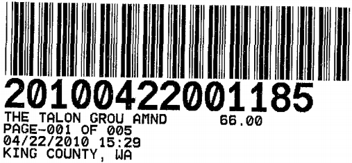
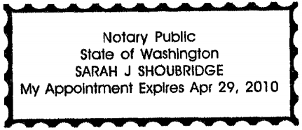

After Recording Mail to:  
Bryce H. Dille  
CAMPBELL, DILLE, BARNETT, SMITH & WILEY, P.L.L.C.  
317 S. Meridian  
P.O. Box 488  
Puyallup, WA 98371

# FOURTH AMENDMENT TO CONDOMINIUM DECLARATION OF THIRTY THIRD PLACE CONDOMINIUMS

Grantor: Thirty Third Place, Inc., a Washington corporation  
Grantee: The Public  
Reference Numbers of Documents Assigned or Released: 20060724000211, 20061025001782 and 20071113001374  
Legal Description: Units A1 through A12, B1 through B12, C1 through C6, D1 through D12, and E1 through E4, of the Thirty Third Place Condominiums recorded under King County Auditor's Recording No. 20060724000211 with Survey Map and Plans recorded under King County Auditor's Recording No. 20060724000210.  
Assessor's Tax Parcel Number: 202505-9243.  

Pursuant to the applicable provisions of RCW 64.34, and in compliance with the amendment provisions of the Condominium Declaration recorded on the 24th day of July, 2006, under King County Auditor's Recording No. 20060724000211 together with the Survey Map and Plans recorded under King County Auditor's Recording No. 20060724000210, and the First Amendment to Condominium Declaration recorded on the 25th day of October, 2006, under King County Auditor's Recoding No. 20061025001783, and the Second Amendment to Condominium Declaration recorded on the 13th day of November, 2007, under King County Auditor's Recording No. 20071113001374, and the Third Amendment to Condominium Declaration recorded on the 13th day of May, 2008, under King County Auditor's Recording No. 20080513001665, the above referenced Condominium Declaration is hereby amended as follows:

1.  Exhibit "B" is hereby amended to read as follows:

# EXHIBIT "B"

Description of Units:

| Unit Identifying Number | Floor | Number of Bathrooms | Number of Bedrooms | Approximate Square Footage of Unit | Parking Space Number(s) assigned to Unit as Limited Common Element | Allocated Interest in Common Element |
| --- | --- | --- | --- | --- | --- | --- |
| A-1 | 1st | 1   | 1   | 629 | 4   | 1/46th |
| A-2 | 1st  | 1   | 2   | 842 | 8, 2 | 1/46th |
| A-3 | 2nd | 2   | 2   | 657 | 3, 5 | 1/46th |
| A-4 | 2nd | 1   | 2   | 856 | 1, 19 | 1/46th |
| A-5 | 3rd | 1   | 1 | 657 | 9   | 1/46th |
| A-6 | 3rd | 1   | 2   | 856 | 10, 6 | 1/46th |
| A-7 | 1st  | 1   | 2   | 845 | 11, 7 | 1/46th |
| A-8 | 1st | 1   | 1   | 629 | 12  | 1/46th |
| A-9 | 2nd | 1   | 2   | 857 | 14  | 1/46th |
| A-10 | 2nd | 1 | 1   | 657 | 13, 18  | 1/46th |
| A-11 | 3rd | 1   | 2   | 856 | 15, 17 | 1/46th |
| A-12 | 3rd | 1   | 1   | 657 | 16, 20 | 1/46th |
| B-1 | 1st  | 1   | 2   | 830 | 44  | 1/46th |
| B-2 | 1st  | 1   | 2   | 830 | 43, 25 | 1/46th |
| B-3 | 2nd | 1   | 2   | 855 | 27  | 1/46th |
| B-4 | 2nd | 1   | 2   | 855 | 40, 41 | 1/46th |
| B-5 | 3rd | 1   | 2   | 855 | 29, 26  | 1/46th |
| B-6 | 3rd | 1   | 2   | 855 | 28  | 1/46th |
| B-7 | 1st | 1   | 2   | 830 | 38,33 | 1/46th |
| B-8 | 1st  | 1   | 2   | 830 | 37  | 1/46th |
| B-9 | 2nd | 1   | 2   | 842 | 39  | 1/46th |
| B-10 | 2nd | 1   | 2   | 842 | 32  | 1/46th |
| B-11 | 3rd | 1   | 2   | 842 | 31  | 1/46th |
| B-12 | 3rd | 1   | 2   | 842 | 30  | 1/46th |
| C-1 | 1st | 1   | 2   | 830 | 46  | 1/46th |
| C-2 | 1st | 1   | 2   | 830 | 45  | 1/46th |
| C-3 | 2nd | 1   | 2   | 852 | 24  | 1/46th |
| C-4 | 2nd | 1   | 2   | 852 | 21, 47  | 1/46th |
| C-5 | 3rd | 1   | 2   | 852 | 22  | 1/46th |
| C-6 | 3rd | 1   | 2   | 852 | 23, 36  | 1/46th |
| D-1 | 1st | 1   | 1   | 636 | 59  | 1/46th |
| D-2 | 1st  | 1   | 2   | 832 | 62  | 1/46th |
| D-3 | 2nd | 1   | 1   | 656 | 60, 68   | 1/46th |
| D-4 | 2nd | 1   | 2   | 851 | 70  | 1/46th |
| D-5 | 3rd | 1   | 1   | 656 | 61, 57  | 1/46th |
| D-6 | 3rd | 1   | 2   | 851 | 69   | 1/46th |
| D-7 | 1st | 1   | 2   | 847 | 78, 72   | 1/46th |
| D-8 | 1st  | 1   | 1   | 636 | 77, 56   | 1/46th |
| D-9 | 2nd | 1   | 2   | 859 | 76, 55   | 1/46th |
| D-10 | 2nd | 1   | 1   | 667 | 75   | 1/46th |
| D-11 | 3rd | 1   | 2   | 859 | 74   | 1/46th |
| D-12 | 3rd | 1   | 1   | 667 | 73   | 1/46th |
| E-1 | 1st  | 1   | 1   | 640 | 66  | 1/46th |
| E-2 | 1st  | 1   | 1   | 640 | 63, 67   | 1/46th |
| E-3 | 2nd | 1   | 1   | 654 | 64  | 1/46th |
| E-4 | 2nd | 1   | 1   | 654 | 65  | 1/46th |

2. The following parking spaces are not assigned parking: 34, 35, 42, 48, 49, 50, 51, 52, 53, 54, 58, 71.
3. All other remaining terms and provisions of this aforesaid Declaration shall remain in full force and effect, except as expressly modified and amended herein. This amendment is made pursuant to paragraph 6.1 of the Condominium Declaration which reserves to the Declarant the right to assign parking stalls. The Declarant hereby reserves the right to assign parking stalls to units which are not assigned as set forth above.

**IN WITNESS WHEREOF**, the undersigned have caused this Fourth Amendment to Declaration to be executed this 20 day of April, 2010.

    

        

            
Thirty Third Place, Inc.

            
By: 

            
Patrick Welton, President Vice

        

        

            
Thirty Third Place Condominium Association

            
By: 

            
Amy Knox, Secretary

        

    

**STATE OF WASHINGTON )**

**COUNTY OF PIERCE )**

On this day personally appeared before me Patrick J. Welton to me known to be the President of Thirty Third Place, Inc., the corporation that executed the foregoing instrument, and acknowledged that he signed the same as his free and voluntary act and deed, for the uses and purposes therein mentioned.

**GIVEN** under my hand and official seal this 20 day of April, 2010.

    

        

            
        

    

    

        

            

            
Printed Name: Sarah J Shoubridge

            
<strong>NOTARY PUBLIC</strong> in and for the State of Washington, residing at Woodinville

            
My commission expires: 4/24/2010

        

    

**STATE OF WASHINGTON )**

**)§**

**COUNTY OF KING )**

On this day personally appeared before me Amy Knox to me known to be the Secretary of Thirty Third Place Condominium Association, the corporation that executed the foregoing instrument, and acknowledged that she signed the same as her free and voluntary act and deed, for the uses and purposes therein mentioned.

**GIVEN** under my hand and official seal this 20 day of April, 2010.

    

        

            
        

    

    

        

            

            
Printed Name: Sarah J Shoubridge

            
<strong>NOTARY PUBLIC</strong> in and for the State of Washington, residing at Woodinville

            
My commission expires: 4/29/2010

        

    

After Recording Mail to:  
Bryce H. Dille  
CAMPBELL, DILLE, BARNETT, SMITH & WILEY, P.L.L.C.  
317 S. Meridian  
P.O. Box 488  
Puyallup, WA 98371  