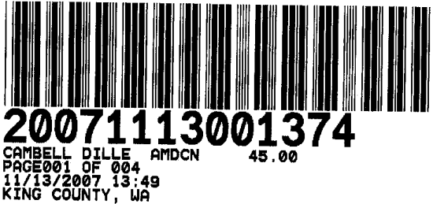

After Recording Mail to:  
Bryce H. Dille  
CAMPBELL, DILLE, BARNETT SMITH & WILEY, P.L.L.C.  
317 S. Meridian  
P.O. Box 488  
Puyallup, WA 98371

# SECOND AMENDMENT TO CONDOMINIUM DECLARATION OF THIRTY THIRD PLACE CONDOMINIUMS

Grantor: Thirty Third Place, Inc., a Washington corporation  
Grantee: The Public  
Reference Numbers of Documents Assigned or Released: 20060724000211 and 20061025001782  
Legal Description: Units A1 through A12, B1 through B12.C1 through C6, D1 through D12, and E1 through E4, of the Thirty Third Place Condominiums recorded under King County Auditor's Recording No. 20060724000211 with Survey Map and Plans recorded under King County Auditor's Recording No. 20060724000210.  
Assessor's Tax Parcel Number: 202505-9243.

Pursuant to the applicable provisions of RCW 64.34, and in compliance with the amendment provisions of the Condominium Declaration recorded on the 24th day of July, 2006, under King County Auditor's Recording No. 20060724000211 together with the Survey Map and Plans recorded under King County Auditor's Recording No. 20060724000210, and the First Amendment to Condominium Declaration recorded on the 25th day of October. 2006, under King County Auditor's Recoding No. 20061025001783, the Declarant does hereby amend the same and states as follows:

**Article 9, Restrictions on Use of Property**, shall he amended to add the following section:

**9.15 Floor Covering Requirement**. All owners of the units on the second and third floors of the condominium building are required to cover a minimum of 65 % of the hard surface flooring of their units in each room with rugs and/or runners.

**Exhibit B,** specifically the parking space numbers assigned to the Units as Limited Common
Elements, shall be amended to provide as follows:

| Unit Identifying Number | Covered Parking Stall assigned to Unit | Uncovered Parking Stall assigned to Unit |
| ----------------------- | -------------------------------------- | ---------------------------------------- |
| A-1                     | 4                                      |                                          |
| A-2                     | 8 and 2                                |                                          |
| A-3                     | 3                                      | 5                                        |
| A-4                     | 1                                      | 19                                       |
| A-5                     | 9                                      |                                          |
| A-6                     | 10                                     | 6                                        |
| A-7                     | 11                                     | 7                                        |
| A-8                     | 12                                     |                                          |
| A-9                     | 14                                     |                                          |
| A-10                    | 13                                     | 18                                       |
| A-11                    | 15                                     | 17                                       |
| A-12                    |                                        | 16 and 20                                |
| B-1                     | 44                                     |                                          |
| B-2                     | 43                                     |                                          |
| B-3                     | 27                                     |                                          |
| B-4                     | 40                                     |                                          |
| B-5                     | 29                                     | 26                                       |
| B-6                     | 28                                     |                                          |
| B-7                     | 38                                     | 33                                       |
| B-8                     | 37                                     |                                          |
| B-9                     | 39                                     |                                          |
| B-10                    | 32                                     |                                          |
| B-11                    | 31                                     |                                          |
| B-12                    | 30                                     |                                          |
| C-1                     | 46                                     |                                          |
| C-2                     | 45                                     |
| C-3                     | 24                                     |
| C-4                     | 21                                     | 47                                       |
| C-5                     | 22                                     |                                          |
| C-6                     | 23                                     |                                          |
| D-1                     | 59                                     |                                          |
| D-2                     | 62                                     |                                          |
| D-3                     | 60                                     | 68                                       |
| D-4                     | 70                                     |                                          |
| D-5                     | 61                                     | 57                                       |
| D-6                     | 69                                     |                                          |
| D-7                     | 78                                     | 72                                       |
| D-8                     | 77                                     | 56                                       |
| D-9                     | 76                                     | 58                                       |
| D-10                    | 75                                     |                                          |
| D-11                    | 74                                     |                                          |
| D-12                    | 73                                     |                                          |
| E-1                     | 66                                     |                                          |
| E-2                     | 63                                     | 67                                       |
| E-3                     | 64                                     |                                          |
| E-4                     | 65                                     |                                          |

Attached to this Second Amendment is an Amended Survey Map and Plans designating the location of the numbered covered and uncovered parking stalls. In addition, on each covered and uncovered parking stall the Declarant has placed a number identifying the parking stall. In the event there is any discrepancy between the location of a parking stall and the number assigned to a unit and the location of the parking stall on the Amended Survey Map and Plans or the original Survey Map and Plans, the number placed on said parking stall control.

All other remaining terms and provisions of this aforesaid Declaration shall remain in full force and effect, except as expressly modified and amended herein. This amendment is made pursuant to paragraph 6.1 of the Condominium Declaration which reserves to the Declarant the right to assign parking stalls. The Declarant hereby reserves the right to assign parking stalls to units which are not assigned as set forth above.

**IN WITNESS WHEREOF**, the undersigned have caused this Second Amendment to Declaration to be executed this 8 day of October, 2007.

    

        

            
<strong>DECLARANT: </strong>Thirty Third Place, Inc., a Washington corporation

            
By: 

            
Patrick J. Welton, President Vice

        

    

**STATE OF WASHINGTON )**

**)§**

**COUNTY OF KING )**

On this day personally appeared before me Patrick J. Welton to me known to be the President of Thirty Third Condominium Association, the corporation that executed the foregoing instrument, and acknowledged that he signed the same as his free and voluntary act and deed, for the uses and purposes therein mentioned.

**GIVEN** under my hand and official seal this 8 day of October, 2007.

    

        

            
        

    

    

        

            

            
Printed Name: Mark A. Larson

            
<strong>NOTARY PUBLIC</strong> in and for the State of Washington, residing at 3015 127 PL SE N-12 BELLEVVE

            
My commission expires: Jul 27, 2011

        

    

