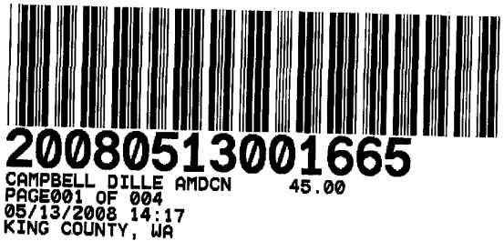
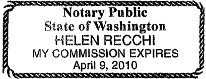
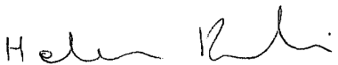

After Recording Mail to:  
Bryce H. Dille  
CAMPBELL, DILLE, BARNETT, SMITH & WILEY, P.L.L.C.  
317 S. Meridian  
P.O. Box 488  
Puyallup, WA 98371

# THIRD AMENDMENT TO CONDOMINIUM DECLARATION OF THIRTY THIRD PLACE CONDOMINIUMS

Grantor: Thirty Third Place, Inc., a Washington corporation  
Grantee: The Public  
Reference Numbers of Documents Assigned or Released: 20060724000211, 20061025001782 and 20071113001374  
Legal Description: Units A1 through A12, B1 through B12, C1 through C6, D1 through D12, and E1 through E4, of the Thirty Third Place Condominiums recorded under King County Auditor's Recording No. 20060724000211 with Survey Map and Plans recorded under King County Auditor's Recording No. 20060724000210.  
Assessor's Tax Parcel Number: 202505-9243.  

Pursuant to the applicable provisions of RCW 64.34, and in compliance with the amendment provisions of the Condominium Declaration recorded on the 24th day of July, 2006, under King County Auditor's Recording No. 20060724000211 together with the Survey Map and Plans recorded under King County Auditor's Recording No. 20060724000210, and the First Amendment to Condominium Declaration recorded on the 25th day of October, 2006, under King County Auditor's Recoding No. 20061025001783, and the Second Amendment to Condominium Declaration recorded on the 13th day of November, 2007, under King County Auditor's Recording No. 20071113001374, the above referenced Condominium Declaration is hereby amended as follows:

1. Article 7, **Allocated Interest in Common Elements, Common Expenses, and Voting Rights,** in particular paragraph 7.1, **Percentages: Ownership and Common Expenses,** is hereby amended to read as follows:

**7.1.1 Percentages for Common Expenses.** The formula for determining each Unit Owner's Common Expense Liability shall be determined by the number of square feet in said Unit in proportion to the total square footage of all Units.

**7.1.1 Percentages for Ownership Interests.** The formula for determining each Unit Owner's undivided ownership interest in the Common Elements shall be determined by dividing into 100 the total number of Units so that each Unit shall have a 1/46th interest in the Common Elements.

2. **Exhibit "B"** be amended to read as follows:

## EXHIBIT "B"

Description of Units:

| Unit Identifying Number | Floor | Number of Bathrooms | Number of Bedrooms | Approximate Square Footage of Unit | Parking Space Number assigned to Unit as Limited Common Element | Allocated Interest in Common Element/Common Expense |
| --- | --- | --- | --- | --- | --- | --- |
| A-1 | 1st | 1   | 1   | 629 | 39  | 1/46 th |
| A-2 | 1st  | 1   | 2   | 842 | 44  | 1/46 th |
| A-3 | 2nd | 1 | 1 | 657 | 37 | 1/46 th |
| A-4 | 2nd | 1  | 2   | 856 | 36  | 1/46 th |
| A-5 | 3rd | 1   | 1   | 657 | 41  | 1/46 th |
| A-6 | 3rd | 1   | 2   | 856 | 40  | 1/46 th |
| A-7 | 1st  | 1   | 2   | 845 | 38  | 1/46 th |
| A-8 | 1st | 1   | 1   | 629 | 42  | 1/46 th |
| A-9 | 2nd | 1   | 2   | 857 | 43  | 1/46 th |
| A-10 | 2nd | 1   | 1 | 657 | 46  | 1/46 th |
| A-11 | 3rd | 1   | 2   | 856 | 45  | 1/46 th |
| A-12 | 3rd | 1   | 1   | 657 | 35  | 1/46 th |
| B-1 | 1st | 1   | 2   | 830 | 19  | 1/46 th |
| B-2 | 1st | 1   | 2   | 830 | 27  | 1/46 th |
| B-3 | 2nd | 1   | 2   | 830 | 21  | 1/46 th |
| B-4 | 2nd | 1   | 2   | 855 | 22  | 1/46 th |
| B-5 | 3rd | 1   | 2   | 855 | 23  | 1/46 th |
| B-6 | 3rd | 1   | 2   | 855 | 30  | 1/46 th |
| B-7 | 1st  | 1   | 2   | 830 | 24  | 1/46 th |
| B-8 | 1st  | 1   | 2   | 830 | 29  | 1/46 th |
| B-9 | 2nd | 1   | 2   | 842 | 28  | 1/46 th |
| B-10 | 2nd | 1   | 2   | 842 | 25  | 1/46 th |
| B-11 | 3rd | 1   | 2   | 842 | 26  | 1/46 th |
| B-12 | 3rd | 1   | 2   | 842 | 20  | 1/46 th |
| C-1 | 1st  | 1   | 2   | 830 | 18  | 1/46 th |
| C-2 | 1st  | 1   | 2   | 830 | 17 | 1/46 th |
| C-3 | 2nd | 1   | 2   | 852 | 34  | 1/46 th |
| C-4 | 2nd | 1   | 2   | 852 | 33  | 1/46 th |
| C-5 | 3rd | 1   | 2   | 852 | 32  | 1/46 th |
| C-6 | 3rd | 1   | 2   | 852 | 31  | 1/46 th |
| D-1 | 1st | 1   | 1   | 636 | 12  | 1/46 th |
| D-2 | 1st  | 1   | 2   | 832 | 11  | 1/46 th |
| D-3 | 2nd | 1   | 1   | 656 | 7   | 1/46 th |
| D-4 | 2nd | 1   | 2   | 851 | 15  | 1/46 th |
| D-5 | 3rd | 1   | 1   | 656 | 16  | 1/46 th |
| D-6 | 3rd | 1   | 2   | 851 | 8   | 1/46 th |
| D-7 | 1st  | 1   | 2   | 847 | 2   | 1/46 th |
| D-8 | 1st  | 1   | 1   | 636 | 3   | 1/46 th |
| D-9 | 2nd | 1   | 2   | 859 | 4   | 1/46 th |
| D-10 | 2nd | 1   | 1   | 667 | 6   | 1/46 th |
| D-11 | 3rd | 1   | 2   | 859 | 5   | 1/46 th |
| D-12 | 3rd | 1   | 1   | 667 | 1   | 1/46 th |
| E-1 | 1st  | 1   | 1   | 640 | 14  | 1/46 th |
| E-2 | 1st  | 1   | 1   | 640 | 9   | 1/46 th |
| E-3 | 2nd  | 1   | 1   | 654 | 13   | 1/46 th |
| E-4 | 2nd  | 1   | 1   | 654 | 10   | 1/46 th |

The allocated Common Expense for each Unit shall be determined by multiplying the annual homeowners dues/assessments by the amount of square footage for each Unit, which shall determine the annual assessment for each Unit and then that amount will be divided by 12 to determine the total monthly dues/assessments for each Unit.

3. All other remaining terms and provisions of this aforesaid Declaration shall remain in full force and effect, except as expressly modified and amended herein. This amendment is made pursuant to paragraph 6.1 of the Condominium Declaration which reserves to the Declarant the right to assign parking stalls. The Declarant hereby reserves the right to assign parking stalls to units which are not assigned as set forth above.

**IN WITNESS WHEREOF,** the undersigned have caused this Third Amendment to Declaration to be executed this 24 day of April, 2008.

    

        

            
<strong>DECLARANT: </strong>Thirty Third Place Condominium Association

            
By: 

            
Patrick J. Welton, President Vice

        

    

**STATE OF WASHINGTON )**

**COUNTY OF PIERCE )**

On this day personally appeared before me Patrick J. Welton to me known to be the President of Thirty Third Place Condominium Association, the corporation that executed the foregoing instrument, and acknowledged that he signed the same as his free and voluntary act and deed, for the uses and purposes therein mentioned.

**GIVEN** under my hand and official seal this 24th day of April, 2008.

    

        

            
        

    

    

        

            

            
Printed Name: Helen Recchi

            
<strong>NOTARY PUBLIC</strong> in and for the State of Washington, residing at Belleme

            
My commission expires: 4/9/10

        

    

